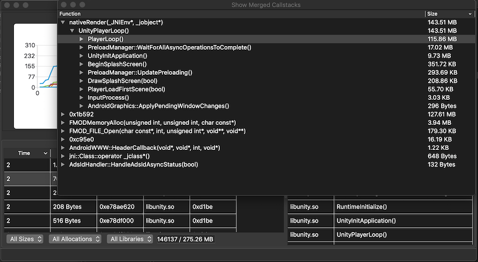

## 写在前面

**通过最近的宣传，已有同事对继续改进LoliProfiler、继续在这个方向做研究表示出合作的兴趣（已有游戏开发、性能工具开发、安卓开发的同事感兴趣），我也会开始筹备此项目的OTeam孵化工作，如果你对安卓平台性能优化感兴趣，也想与我们合作开发性能优化工具，也欢迎与我（xinhou）联系**

# Loli Profiler

轻量开源内存分析工具（Lightweight Opensource profiLing Instrument）

**目前支持Windows7/10与MacOSX（Mojave+），需要Python2.x**

可前往LoliProfiler的[Wetest商店页面](https://wetest.oa.com/store/loli-profiler)下载最新版程序

> [使用手册](https://git.code.oa.com/xinhou/loli_profiler/wikis/tutorial)、[常见问题](https://git.code.oa.com/xinhou/loli_profiler/wikis/faq)、[程序下载](https://git.code.oa.com/xinhou/loli_profiler/wikis/home)、[WeTest商店](https://wetest.oa.com/store/loli-profiler)

**求助：目前的方案仍存在一个不同abi获取堆栈数据会[崩溃的问题](https://git.code.oa.com/xinhou/loli_profiler/issues/21)，有熟悉安卓开发的朋友，希望给一些改进建议**

**提示：若您觉得Profiler工具本身或其实现原理对您所在的项目有所帮助，非常欢迎您[告诉我](https://git.code.oa.com/xinhou/loli_profiler/issues/23)项目的名称**





**注意：此程序仍处于初级研发阶段**

## 特性

- 可以Profile所有Debuggable的程序（Root后的设备可Profile所有程序）
- 可通过[此方法](https://git.code.oa.com/xinhou/loli_profiler/wikis/profile-release-build-apks/)Profile Release版本的程序
- 可Hook目标APK中任意so库
- Hook上的内存函数malloc、calloc、realloc、memalign、free
- 可将函数地址自动批量转换为函数名称
- 自动分析数据展示常驻内存
- 获取并分析smaps数据，得到不同so、模块的内存总分配情况
- 结合smaps数据与内存分配数据，可绘制出近似的内存碎片图
- 将数据整理为TreeMap形式展示，方便观察
- 每5s自动截图一次
- 从手机端实时获取内存相关函数的堆栈信息（通过TCP Socket）
- 网络包使用LZ4压缩以加快收发速度
- 运行流畅（使用C++与QT开发）
- 同时支持Windows 10与Mac OSX（Mojave+）操作系统

## 简介

首先在移动设备上安装debuggable的apk程序，打开LoliProfiler，首先选择Python的路径，接着输入apk程序名称如：com.company.name，最后点击Launch即可。采集一段时间数据后，点击Stop Capture，即可完成采集。完成采集后LoliProfiler会分析获取的数据，并将采集结束前未释放的内存数据展示在StackTrace页签中。一般情况下堆栈数据会包含函数地址信息，你需要提供安卓NDK工具链中的addr2line可执行程序的路径给LoliProfiler。接着就可以选择Load Symbol来加载符号表数据，当翻译完成后，StackTrace中的数据就会被翻译为真正的函数名称。


对于Unity于UE4，可使用如下选项让引擎使用malloc进行内存分配，便于定位真正的问题

### Unity

```java
protected String updateUnityCommandLineArguments(String cmdLine) {
    return "-systemallocator";
}
```

### UE4

```c++
FMalloc* FAndroidPlatformMemory::BaseAllocator() {
#if USE_MALLOC
    return new FMallocAnsi();
#else
    return new FMallocBinned(MemoryConstants.PageSize, MemoryLimit);
#endif
}
```

## 计划

**短期计划**

* 交互、性能优化
* 实现更标准的[内存碎片展示功能](https://git.code.oa.com/xinhou/loli_profiler/issues/8)
* 计划中 ... 

## 技术选择

我通过JDWP（ Java Debug Wire Protocol）技术进行对目标程序的动态库注入

在动态库的 JNI_OnLoad 中对 Profile 程序进行初始化（开启 TCP Server，开启检测线程等）

我选择 PLT Hook 技术，因为其有成熟稳定的[产品级实现](https://github.com/iqiyi/xHook)，且其不用考虑函数重入的问题，也没有在 GCC 编译器下出现的 Unwind 库 ABI 不兼容导致的[崩溃问题](https://git.code.oa.com/xinhou/loli_profiler/issues/12)。唯一的问题是目标库必须已加载到程序后，才可以被 PLT Hook 上

最终我通过开线程定时读取 [proc/self/maps](https://stackoverflow.com/questions/1401359/understanding-linux-proc-id-maps) 数据来判断目标库是否已加载到程序中，然后再去重新做 Hook 以在目标库加载入程序后及时 Hook 到其内存函数的目的

## 编译

**环境**

* QT 5 或更高
* 安装QtCharts插件
* QT Creater 4.8 或更高
* C++11 编译器
* Android NDK r16b 或更高（如需自行编译安卓插件）

## 链接

* Wetest Store https://wetest.oa.com/store/loli-profiler
* 程序下载 https://git.code.oa.com/xinhou/loli_profiler/wikis/home
* 使用手册 https://git.code.oa.com/xinhou/loli_profiler/wikis/tutorial
* 常见问题 https://git.code.oa.com/xinhou/loli_profiler/wikis/faq
* KM原理介绍文章 http://km.oa.com/articles/show/408991
* xHook https://github.com/iqiyi/xHook
* JDWP库 https://koz.io/library-injection-for-debuggable-android-apps/
* TreeMap实现 https://github.com/yahoo/YMTreeMap
* 图标 https://www.flaticon.com/authors/smashicons
* 工具图标 https://www.flaticon.com/authors/freepik
