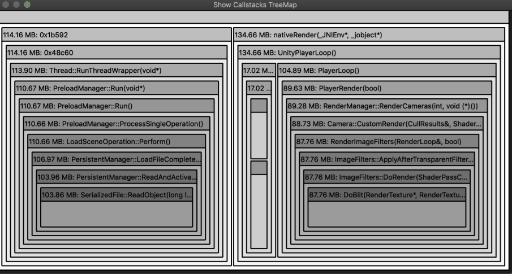
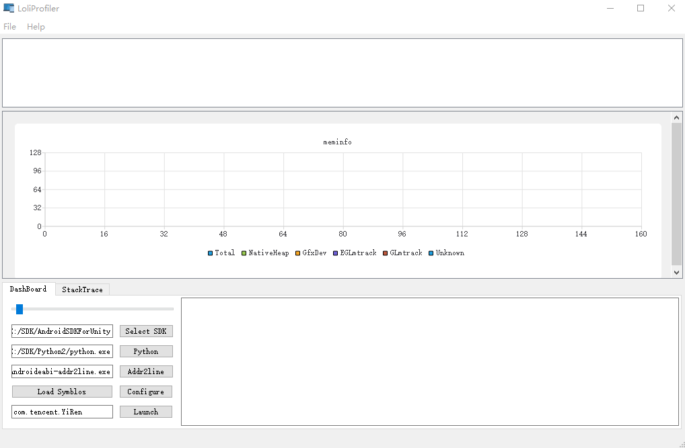

[TOC]

## 写在前面

**LoliProfiler已正式开始OTeam孵化的工作，欢迎对安卓内存优化感兴趣的同事加入**

**若您觉得工具对您有所帮助，并支持我们的开发，可以用Star+Watch来表示您的支持** :smile: 

已完成3个Milestone的开发，Preview版本可在[WeTest商店](https://wetest.oa.com/store/loli-profiler)下载体验

OTeam地址：https://techmap.oa.com/oteam/8618

性能已在大型UE4项目验证（骁龙855及以上CPU可较流畅体验，约增加 1.6x-2.2x Overhead），目前官方已支持4.24，4.25

可参考[此教程](https://git.code.oa.com/xinhou/loli_profiler/wikis/tutorial/ue4-integration)对您的UE4引擎进行修改以支持LoliProfiler。其他版本的UE4或Unity引擎可联系我协助测试

### 使用过的项目

| 《全民K歌》                       | 《微视Android》                   | 《秦时明月世界》              | 《天涯明月刀手游》                            |
| --------------------------------- | --------------------------------- | ----------------------------- | --------------------------------------------- |
|         |  |  |              |
| [评测](http://mk.oa.com/note/686) |                                   |                               | [评测](http://mk.oa.com/note/676?ADTAG=bsygz) |

*若本工具对您所在的项目组有所帮助，欢迎联系我更新此列表*


# Loli Profiler

轻量开源内存分析工具（Lightweight Opensource profiLing Instrument）

**支持Windows7/10与MacOSX（Mojave+）**

可前往LoliProfiler的[Wetest商店页面](https://wetest.oa.com/store/loli-profiler)下载最新版程序

> [使用手册](https://git.code.oa.com/xinhou/loli_profiler/wikis/tutorial)、[白皮书](https://git.code.oa.com/xinhou/loli_profiler/wikis/home)、[常见问题](https://git.code.oa.com/xinhou/loli_profiler/wikis/faq)、[WeTest商店](https://wetest.oa.com/store/loli-profiler)



## 特性

- 支持Windows 10与Mac OSX（Mojave+）操作系统
- 可以Profile几乎所有Debuggable的程序（Root后的设备可Profile所有程序）
- 支持程序运行中注入
- 整合动态库后，支持调试未加壳加密的Release版程序
- 运行流畅（使用C++与QT开发），内存占用低（Streaming数据优化）
- 通过TCP Socket实时传输数据
- 数据分析：TreeMap、CallTree、内存碎片
- 自动截图、Meminfo图表
- 支持最高效的堆栈回溯方案



## 开发团队

| Name                                                | BG                                                           |
| --------------------------------------------------- | ------------------------------------------------------------ |
| [xinhou](https://git.code.oa.com/u/xinhou)          | IEG互动娱乐事业群/魔方工作室群/技术中心/引擎中心/公共研发组  |
| [ikeshi](https://git.code.oa.com/u/ikeshi)          | IEG互动娱乐事业群/品质管理部/WeTest产品中心/APM项目组        |
| [looperzeng ](https://git.code.oa.com/u/looperzeng) | 公司其他组织/腾讯音乐娱乐/QQ音乐业务线/社区产品部/商业产品中心/Android开发组 |
| [pisazzpan](https://git.code.oa.com/u/pisazzpan)    | 公司其他组织/腾讯音乐娱乐/QQ音乐业务线/社区产品部/平台产品中心/Android开发组 |
| [ashenzhou](https://git.code.oa.com/u/ashenzhou)    | IEG互动娱乐事业群/研发效能部/GCloud技术服务中心/同步技术研发组 |
| [nicochen](https://git.code.oa.com/u/nicochen)      | IEG互动娱乐事业群/魔方工作室群/魔术师工作室/S1产品中心/UA预研组/程序组/前台开发组 |
| [togchen](https://git.code.oa.com/u/togchen)        | IEG互动娱乐事业群/魔方工作室群/技术中心/引擎中心/公共研发组  |
| [peihualin](https://git.code.oa.com/u/peihualin)    | IEG互动娱乐事业群/光子工作室群/R工作室/X-Game项目组/前台程序组 |
| [luckyguo](https://git.code.oa.com/u/luckyguo)      | 公司其他组织/腾讯音乐娱乐/QQ音乐业务线/音乐产品质量中心/专项测试开发组 |
| [georgehu](https://git.code.oa.com/georgehu)        | IEG互动娱乐事业群/光子工作室群/量子工作室/国际化开发中心/统筹支持组/预研支持组 |
| [yiminghu](https://git.code.oa.com/u/yiminghu)      | IEG互动娱乐事业群/魔方工作室群/技术中心/引擎中心/公共研发组  |

*排名不分先后*

## 编译

**环境**

* QT 5 或更高（安装QtCharts插件）
* C++11 编译器，CMake
* Android NDK r16b / r20

**一键构建**

Mac：

```bash
export QT5Path=/Users/xinhou/Qt5.14.1
export Ndk_R16_CMD=/android-ndk-r16b/ndk-build
export Ndk_R20_CMD=/android-ndk-r20b/ndk-build
sh build.sh
```

Windows:

```bash
set QT5Path="D:/SDK/QT/5.14.1/msvc2017_64"
set MSBUILD_EXE="%ProgramFiles(x86)%\Microsoft Visual Studio\2017\Community\MSBuild\15.0\Bin\MSBuild.exe"
set Ndk_R16_CMD="/android-ndk-r16b/ndk-build.cmd"
set Ndk_R20_CMD="/android-ndk-r20b/ndk-build.cmd"
build.bat
```

### ChangeList

**v1.0.3**

默认使用run-as cat获取smaps，更稳定，失败后再fallback到走socket

**v1.0.2**

CI自动构建jdwputil动态库，提供UE4插件，方便UE4项目使用调试Release版APK的功能

**v1.0.1**

提升了网络相关代码的稳定性

提升了重复测试时的稳定性

**v0.9.9d**

提供[接口](https://git.code.oa.com/xinhou/loli_profiler/wikis/tutorial/hooking-memory-pool)支持Hook使用内存池的进程

可将单条内存申请记录翻译为代码文件+行号，方便定位问题

**v0.9.9b**

实现了数据Streaming功能，有效降低了内存占用

可对大型（游戏）项目进行长时间的数据采集

**v0.9.9**

支持基于Framepointer的堆栈回溯优化，已在UE4.24、4.25上测试有效

性能优于插桩优化，可参考[此教程](https://git.code.oa.com/xinhou/loli_profiler/wikis/tutorial/ue4-integration#%E5%BC%95%E6%93%8E%E4%BF%AE%E6%94%B9%E6%96%B9%E6%A1%88%E4%B8%80)对您的UE4项目进行打包

优化了结束采集后的内存地址分类步骤，速度提升10x

优化了离线函数地址翻译步骤（感谢lusliu提供的思路），速度提升20x

**v0.9.8**

支持调试经过编译器插桩优化的UE4的APK，可将多线程情况下的堆栈获取速度提升10倍

可参考[此教程](https://git.code.oa.com/xinhou/loli_profiler/wikis/tutorial/ue4-integration)对您的UE4项目进行打包，即可对APK进行更高效的调试

## 链接

* Wetest Store https://wetest.oa.com/store/loli-profiler
* 程序下载 https://git.code.oa.com/xinhou/loli_profiler/wikis/home
* 使用手册 https://git.code.oa.com/xinhou/loli_profiler/wikis/tutorial
* 常见问题 https://git.code.oa.com/xinhou/loli_profiler/wikis/faq
* KM原理介绍文章 http://km.oa.com/group/29321/articles/show/434653
* xHook https://github.com/iqiyi/xHook
* JDWP库 https://koz.io/library-injection-for-debuggable-android-apps/
* TreeMap实现 https://github.com/yahoo/YMTreeMap
* FramePointer堆栈回溯实现 https://chromium.googlesource.com/chromium/src/base/+/master/debug/stack_trace.cc
* 图标 https://www.flaticon.com/authors/smashicons
* 工具图标 https://www.flaticon.com/authors/freepik
