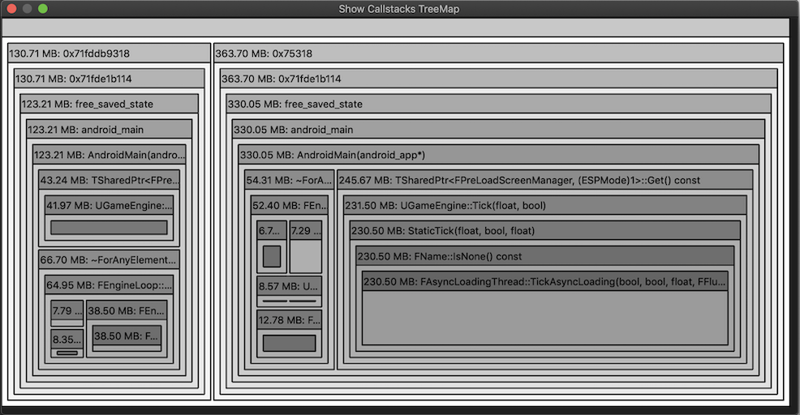

## 写在前面

**通过最近的宣传，已有同事对继续改进LoliProfiler、继续在这个方向做研究表示出合作的兴趣（已有游戏开发、性能工具开发、安卓开发的同事感兴趣），我们已经正式开始OTeam孵化的工作，如果你对安卓平台性能优化感兴趣，也想与我们合作开发性能优化工具，也欢迎与我（xinhou）联系**

**当然如果仅仅是使用了LoliProfiler并觉得希望继续使用，并支持我们的开发，也可以很简单的以点Star+Watch来表示你的支持（我们也非常需要Star与Watch的支持）** :smile: 

第一个[milestone](https://git.code.oa.com/xinhou/loli_profiler/-/milestones/1)已完成开发，Preview版本可在[WeTest商店](https://wetest.oa.com/store/loli-profiler)下载体验

OTeam地址：https://techmap.oa.com/oteam/8618

# Loli Profiler

轻量开源内存分析工具（Lightweight Opensource profiLing Instrument）

**支持Windows7/10与MacOSX（Mojave+）**

可前往LoliProfiler的[Wetest商店页面](https://wetest.oa.com/store/loli-profiler)下载最新版程序

> [使用手册](https://git.code.oa.com/xinhou/loli_profiler/wikis/tutorial)、[常见问题](https://git.code.oa.com/xinhou/loli_profiler/wikis/faq)、[程序下载](https://git.code.oa.com/xinhou/loli_profiler/wikis/home)、[WeTest商店](https://wetest.oa.com/store/loli-profiler)

**提示：若您觉得Profiler工具本身或其实现原理对您所在的项目有所帮助，非常欢迎您[告诉我](https://git.code.oa.com/xinhou/loli_profiler/issues/23)项目的名称**

**注意：此程序仍处于初级研发阶段**

## 特性

- 可以Profile所有Debuggable的程序（Root后的设备可Profile所有程序）
- 可Hook目标APK中任意so库
- 支持App运行中注入
- Hook上的内存函数malloc、calloc、realloc、memalign、free
- 可将函数地址自动批量转换为函数名称
- 自动分析数据展示常驻内存
- 获取并分析smaps数据，得到不同so、模块的内存总分配情况
- 结合smaps数据与内存分配数据，可绘制出近似的内存碎片图
- 将数据整理为TreeMap形式展示，方便观察
- 每5s自动截图一次
- 从手机端实时获取内存相关函数的堆栈信息（通过TCP Socket）
- 网络包使用LZ4压缩以加快收发速度
- 运行流畅（使用C++与QT开发）
- 同时支持Windows 10与Mac OSX（Mojave+）操作系统

## 开发团队

| Name                                                | BG                                                           |
| --------------------------------------------------- | ------------------------------------------------------------ |
| [xinhou](https://git.code.oa.com/u/xinhou)          | IEG互动娱乐事业群/魔方工作室群/技术中心/引擎中心/公共研发组  |
| [ikeshi](https://git.code.oa.com/u/ikeshi)          | IEG互动娱乐事业群/品质管理部/WeTest产品中心/APM项目组        |
| [looperzeng ](https://git.code.oa.com/u/looperzeng) | 公司其他组织/腾讯音乐娱乐/QQ音乐业务线/社区产品部/商业产品中心/Android开发组 |
| [pisazzpan](https://git.code.oa.com/u/pisazzpan)    | 公司其他组织/腾讯音乐娱乐/QQ音乐业务线/社区产品部/平台产品中心/Android开发组 |
| [ashenzhou](https://git.code.oa.com/u/ashenzhou)    | IEG互动娱乐事业群/研发效能部/GCloud技术服务中心/同步技术研发组 |
| [nicochen](https://git.code.oa.com/u/nicochen)      | IEG互动娱乐事业群/魔方工作室群/魔术师工作室/S1产品中心/UA预研组/程序组/前台开发组 |
| [togchen](https://git.code.oa.com/u/togchen)        | IEG互动娱乐事业群/魔方工作室群/技术中心/引擎中心/公共研发组  |
| [peihualin](https://git.code.oa.com/u/peihualin)    | IEG互动娱乐事业群/光子工作室群/R工作室/X-Game项目组/前台程序组 |
| [luckyguo](https://git.code.oa.com/u/luckyguo)      | 公司其他组织/腾讯音乐娱乐/QQ音乐业务线/音乐产品质量中心/专项测试开发组 |
| [georgehu](https://git.code.oa.com/georgehu)        | IEG互动娱乐事业群/光子工作室群/量子工作室/国际化开发中心/统筹支持组/预研支持组 |

*排名不分先后*

## 技术选择

我通过JDWP（ Java Debug Wire Protocol）技术进行对目标程序的动态库注入

在动态库的 JNI_OnLoad 中对 Profile 程序进行初始化（开启 TCP Server，开启检测线程等）

我选择 PLT Hook 技术，因为其有成熟稳定的[产品级实现](https://github.com/iqiyi/xHook)，且其不用考虑函数重入的问题，也没有在 GCC 编译器下出现的 Unwind 库 ABI 不兼容导致的[崩溃问题](https://git.code.oa.com/xinhou/loli_profiler/issues/12)。唯一的问题是目标库必须已加载到程序后，才可以被 PLT Hook 上

最终我通过开线程定时读取 [proc/self/maps](https://stackoverflow.com/questions/1401359/understanding-linux-proc-id-maps) 数据来判断目标库是否已加载到程序中，然后再去重新做 Hook 以在目标库加载入程序后及时 Hook 到其内存函数的目的

## 编译

**环境**

* QT 5 或更高
* 安装QtCharts插件
* QT Creater 4.8 或更高
* C++11 编译器
* Android NDK r16b 或更高（如需自行编译安卓插件）

## 链接

* Wetest Store https://wetest.oa.com/store/loli-profiler
* 程序下载 https://git.code.oa.com/xinhou/loli_profiler/wikis/home
* 使用手册 https://git.code.oa.com/xinhou/loli_profiler/wikis/tutorial
* 常见问题 https://git.code.oa.com/xinhou/loli_profiler/wikis/faq
* KM原理介绍文章 http://km.oa.com/articles/show/408991
* xHook https://github.com/iqiyi/xHook
* JDWP库 https://koz.io/library-injection-for-debuggable-android-apps/
* TreeMap实现 https://github.com/yahoo/YMTreeMap
* 图标 https://www.flaticon.com/authors/smashicons
* 工具图标 https://www.flaticon.com/authors/freepik
