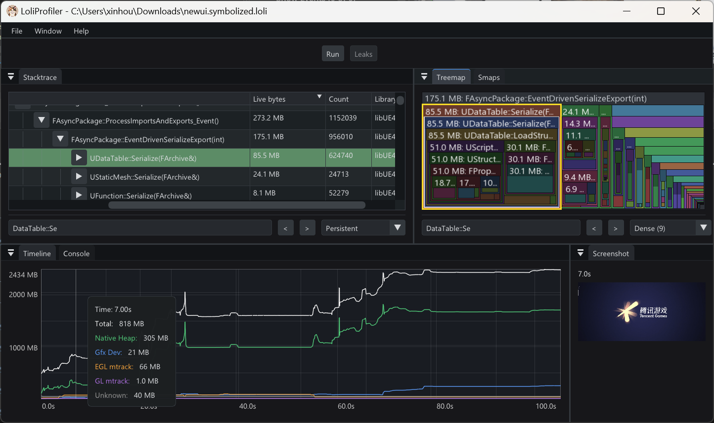

# LoliProfiler


LoliProfiler captures native allocations in Android applications and displays call stacks, a treemap, memory timeline, screenshots, and smaps data. The desktop GUI and headless capture CLI use the same Qt-free C++ core.



## Build

From the repository root:

```sh
python scripts/build.py
```

The interactive menu builds the GUI, CLI, Android hooks, and release zip. SDK/NDK downloads require your confirmation. See the [build guide](docs/BUILD.md) for prerequisites, non-interactive commands, and Windows/macOS/Linux details.

The GUI's **Console** tab shows capture and load timings. GUI and CLI use the same logging API; add `--log-file profiler.log` to save timestamped diagnostics and `--log-level debug` for more detail. See the [quick start](docs/QUICK_START.md).

## Documentation

- [Quick start](docs/QUICK_START.md) ([Chinese](docs/QUICK_START_CN.md))
- [macOS build notes](docs/BUILD_MACOS.md) and [Linux build notes](docs/BUILD_LINUX.md)
- [Capture, dump, and compare CLI](docs/CLI_MODE.md)
- [Python agent CLI](agentcli/README.md) for indexed `.db` heap exploration
- [Game engine integration](docs/GAME_ENGINE.md) ([Chinese](docs/GAME_ENGINE_CN.md))
- [Troubleshooting](docs/TROUBLE_SHOOTING.md) and [architecture](docs/ARCH.md)

## What the tools do

| Tool | Use |
| --- | --- |
| `LoliProfilerImGui` | Launch or attach, inspect live/saved captures, and save `.loli` files. |
| `LoliProfilerCLI` | Capture headlessly; export `.txt` or SQLite `.db`; compare captures; symbolize offline. |
| `agentcli` Python package | Query the SQLite call tree from scripts or agents. The `loli` command remains available. |

During capture, choose whether to keep every allocation record or retain only allocations still live at stop. In the Stacktrace panel, the **All Allocations / Persistent** selector changes the inspection view for saved records. Symbol names require a matching application library with suitable debug information.

## Open-source components

| Project | Role |
| --- | --- |
| [Dear ImGui](https://github.com/ocornut/imgui) | Dockable desktop interface. |
| [ImGui-SFML](https://github.com/SFML/imgui-sfml) | ImGui rendering and event integration. |
| [SFML](https://github.com/SFML/SFML) | Window, graphics, and device socket transport. |
| [nativefiledialog-extended](https://github.com/btzy/nativefiledialog-extended) | Native file and folder dialogs. |
| [tiny-process-library](https://github.com/eidheim/tiny-process-library) | ADB, Python, and symbol-tool subprocesses. |
| [RapidJSON](https://github.com/Tencent/rapidjson) | Application settings. |
| [SQLite](https://www.sqlite.org/amalgamation.html) | Indexed `.db` snapshot export and agent queries. |
| [LZ4](https://github.com/lz4/lz4) | Compressed capture packets. |
| [xHook](https://github.com/iqiyi/xHook) | Android native allocation hooks. |
| [Nougat_dlfunctions](https://github.com/avs333/Nougat_dlfunctions) | Android symbol lookup helper. |

The Android hook also draws on upstream stack-trace and sampling techniques documented in [Chromium](https://chromium.googlesource.com/chromium/src/base/+/master/debug/stack_trace.cc) and [Perfetto](https://perfetto.dev/). The JDWP injection approach is described in [this article](https://koz.io/library-injection-for-debuggable-android-apps/). Legacy toolbar assets credit [Smashicons](https://www.flaticon.com/authors/smashicons) and [Freepik](https://www.flaticon.com/authors/freepik).

## License

See [LICENSE](LICENSE) and the licenses in each vendored component.
