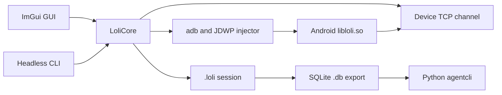

# Architecture

LoliProfiler has two native executables and one Python analysis package. The GUI and headless CLI link the same Qt-free `LoliCore` library. `agentcli` reads SQLite snapshots exported by the native CLI.

## Main components

| Component | Source | Responsibility |
| --- | --- | --- |
| GUI shell | `src/gui/main_imgui.cpp` | Dock layout, menus, shortcuts, modal dialogs, and frame loop. |
| GUI session bridge | `src/gui/guidatabridge.cpp` | Capture state and published snapshots; adopts completed file work on the GUI thread. |
| Capture controls | `src/gui/runlaunchdialog.cpp`, `captureconfigdialog.cpp` | Device, app, retention policy, and `loli3.conf` settings. |
| Headless capture | `src/main_cli2.cpp`, `src/clicapture.cpp` | Timed/attached capture and `.loli` save. |
| Launch/injection | `src/launchdriver.cpp` | Push hook library/config, start or attach, forward JDWP, run injector. |
| Device transport | `src/stacktracechannel.cpp`, `src/devicechannel.cpp` | Decode compressed allocation/free packets over the forwarded TCP connection. |
| Process and async work | `src/processrunner.cpp`, `src/threadpool.cpp` | ADB/NDK subprocesses, waits, cancellation, and off-thread work. |
| Logging | `include/lolilogger.h`, `src/lolilogger.cpp` | Shared GUI/CLI severity levels, source-tagged records, Console ring, and optional file/terminal sinks. |
| File format | `src/lolistream.cpp`, `src/lolirecord.cpp` | Read/write version-106 `.loli` files in the old Qt-compatible byte layout. |
| Analysis/export | `src/profilecomparatorlite.cpp`, `src/profilecomparatorlite_sqlite.cpp` | Live/cumulative trees, comparisons, text reports, and SQLite snapshots. |
| Python queries | `agentcli/` | Indexed tree exploration; installed commands are `loli` and `agentcli`. |

## Capture flow

1. The selected SDK's `adb` lists devices; Run/Launch checks that a device is online.
2. `LaunchDriver` pushes the architecture-matched `libloli.so`, starts or attaches to the package, forwards JDWP, and invokes the Python injector.
3. The injector loads the Android hook library. Its server streams allocation and free events to `StacktraceChannel` through an ADB TCP forward.
4. The capture session associates frame addresses with smaps libraries, translates symbols when a matching file is provided, and writes `.loli`.
5. The GUI builds call trees and timeline views from loaded or captured sessions. `--dump` exports the live snapshot to `.txt` or SQLite `.db`.

## Threading and ownership

The GUI frame loop pumps the stacktrace channel and adopts completed file loads, saves, screenshots, and meminfo samples. Process callbacks put samples in a synchronized queue; they do not mutate the active session directly. The bridge waits for its worker pool before destruction. The CLI pumps its event bus from the consumer thread.

The launch-time **Record retention** choice controls retention during capture. **Live at stop** discards freed allocation stacks as free events arrive and restores retained records to arrival order before save; **All allocations** keeps full history. The **All Allocations / Persistent** dropdown in Stacktrace is a separate saved-file view control shared with Treemap and Leaks.

GUI and CLI diagnostics use `LoliLogger` in `LoliCore`. New code should use `LOLI_INFO`, `LOLI_WARN`, `LOLI_ERROR`, or `LOLI_DEBUG` with a category; those macros record source location. The GUI Console and optional `--log-file` receive the same records, while CLI report text keeps its existing stdout format.

## File compatibility

`.loli` is a big-endian, version-106 binary format originally written by Qt `QDataStream`. The Qt-free reader/writer preserves its field order and encodings; see [the format notes](../openspec/changes/remove-qt-dependency/loli-format.md). SQLite `.db` exports use schema version 1 with `metadata`, `libraries`, `symbols`, and indexed `nodes` tables.

For build and deployment instructions, see [Build](BUILD.md), [Linux](BUILD_LINUX.md), and the [quick start](QUICK_START.md).
