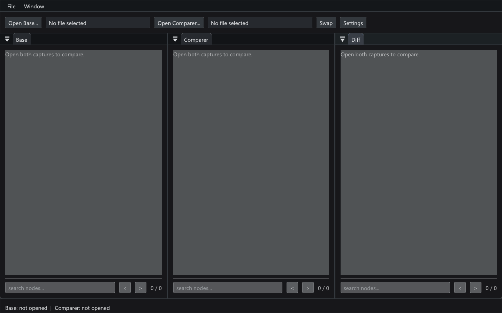
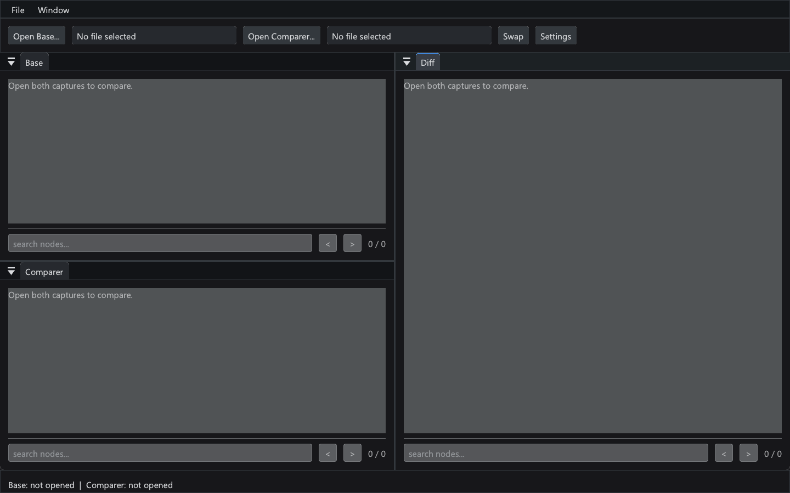

# Comparing captures

The main ImGui app's **Compare** toolbar button and **File > Compare** open a separate `LoliProfilerCompare` process. It stays open when the profiling app closes.



Screenshots in this guide show the UI with **no captures opened**, so no private file paths, allocation records, or symbols are exposed.

Choose both captures using **Open Base** and **Open Comparer** in the single-row toolbar. Their filename slots have fixed widths; hover to see full paths, which also appear in the native window title. Loading progress and allocation totals appear in the bottom status bar.

The dockable **Base**, **Comparer**, and **Diff** panels default to three equal columns. Drag their tabs to split, stack, or group them. **Window > Base above Comparer, Diff right** provides that arrangement directly; **Window > Three columns** restores the default. The workspace is saved separately in `loli_compare_imgui.ini` beside the settings file.



Each panel keeps its own node search footer, match navigation, selection, expansion, and sorting. Enter moves to the next match; `<` and `>` wrap through matches. Search includes function and library names, reveals collapsed ancestors, and scrolls to the selected node. Right-click a node to copy exact values. Expand/collapse-all controls are omitted.

Open **Settings** from the toolbar or **File > Settings** to change the theme. Theme changes apply immediately and are saved using the existing preference. The less frequently used **Skip root levels** control also lives in Settings; changing it rebuilds the selected captures with that many outer stack frames omitted. The same option remains available as `--skip-root-levels N` on the command line.

Diff is **comparison minus base**. Red indicates byte growth; green indicates reduction. Hover a node for exact base/comparison values, inclusive deltas, and self deltas. Inclusive values include children; self values account for allocations ending directly at that node. Zero-net parents remain visible if descendants changed. **Swap** reverses the inputs. **File > Export Diff** saves the same report the CLI produces.

## Standalone window

```powershell
# Select both files interactively
.\LoliProfilerCompare.exe

# Load both files immediately
.\LoliProfilerCompare.exe base.loli comparison.loli

# Named arguments (a missing input can be selected in the window)
.\LoliProfilerCompare.exe --base base.loli --compare comparison.loli --skip-root-levels 2

```

The executable is `LoliProfilerCompare` on Linux/macOS. Loading and comparison run off the UI thread; each tree renders only visible rows.

## Headless CLI

```powershell
.\LoliProfilerCLI.exe --compare base.loli comparison.loli --out diff.txt
.\LoliProfilerCLI.exe --compare base.loli comparison.loli --out diff.txt --skip-root-levels 2
```

Both consumers call `loli::CompareFiles` and `loli::WriteComparisonReport` in LoliCore. Reports contain exact signed integer bytes/counts, library-qualified paths, and four-space indentation:

```text
=== Memory Diff (Comparison - Base) ===
Columns: function [library], delta bytes, delta count, self delta bytes, self delta count

root [game.so], +15, +0, -10, +0
    child [game.so], +25, +0, +25, +0
```

Names can contain commas, so parse the four numeric fields from the right. Header statistics report live totals, signed total deltas, and changed/new/removed **allocation stack paths**, not raw record identities or inclusive tree-node counts.

## Comparison rules

- Both sides exclude allocations whose sequence precedes the latest saved free event at the same address. A reused address's later allocation remains live.
- Stack paths match by exact parent path, library name, and resolved function name. UUIDs, intern hashes, and heap addresses need not match across captures. Unresolved functions use their address within the named library.
- Every byte/count change is kept: reductions, removed branches, sub-1-KiB changes, count-only changes, and resizing without count growth.
- Records with unavailable stacks appear under `[missing call stack]`. Skipping an entire stack retains its totals under `[stack omitted by root skipping]`.
- Use matching symbols for each capture's own build. Differing symbol quality can produce separate paths. Heuristic pairing of pseudo-symbol subtrees from the referenced fork is deliberately omitted to avoid false matches.
- Inputs are standard version-106 captures. The fork's version-107 comparison-file extension is not imported.
- Signed diffs cannot be represented faithfully by the capture `.loli` format (signed counts, internal self deltas, and 64-bit totals). Comparison rejects `--out diff.loli`; use a text report. Original input captures are never overwritten by comparison export.

This replaces the old CLI's thresholded cumulative growth-only report. Snapshot `--dump` and timeline **Leaks** retain their existing behavior.

## Validation and credits

The engine is covered by synthetic regression fixtures and independent randomized path aggregation, plus an independent capture-wire reader for local validation. Forward/reverse/identical comparisons, GUI/CLI report parity, independent panel searches, and saved docking layouts were checked. Private capture names, paths, and results are excluded from this guide.

The comparison feature is based on [leoin2012's LoliProfiler fork](https://github.com/leoin2012/loli_profiler). The upstream Loli Compare module identifies **shuchangliu** as its contributor. This implementation brings that comparison workflow to the Qt-free shared core and ImGui GUI, with independent accuracy checks and the complete signed-diff rules described above.
