# LoliProfiler CLI Mode

## Overview

LoliProfiler now includes a dedicated CLI executable (`LoliProfilerCLI.exe`) designed for CI/CD integration and automated testing workflows. This console application allows you to profile Android applications without the GUI, automatically capture memory data, and save results to `.loli` files for later analysis.

## Executables

- **LoliProfiler.exe** - GUI application
- **LoliProfilerCLI.exe** - Dedicated console application (CLI only, smaller size, better console integration)

## Features

- **Headless Operation**: No GUI required, perfect for CI/CD pipelines
- **Automatic Launch & Injection**: Automatically starts and injects profiling hooks
- **Flexible Capture Modes**: 
  - Timed profiling (fixed duration)
  - Manual stop with Ctrl+C (profile until you're ready to stop)
- **Graceful Shutdown**: Ctrl+C triggers proper data collection and file save
- **Symbol Translation**: Automatic address-to-symbol translation with symbol files
- **Data Optimization**: Streaming mode enabled by default for large datasets
- **Device Selection**: Support for multiple connected Android devices

## Command-Line Options

All options use Qt's standard format: `--option value` (double dash with space-separated value).

### Required Options

- `--app <package_name>` - Target application package name (e.g., `com.example.game`)
- `--out <output_path>` - Output `.loli` file path

### Optional Options

- `--symbol <symbol_path>` - Path to symbol file (`.so` or `.sym`) for address translation
- `--subprocess <name>` - Target subprocess name (if app uses multiple processes)
- `--device <serial>` - Device serial number (required when multiple devices connected)
- `--duration <seconds>` - Profiling duration in seconds (omit for manual stop with Ctrl+C)
- `--attach` - Attach to running app instead of launching new instance
- `--verbose` - Enable verbose output for debugging
- `--help` or `-h` - Display help message

> All other options will use what you set in gui mode.

## Usage Examples

### Basic Usage

Profile an app for 60 seconds:

```bash
# Using dedicated CLI executable (recommended)
LoliProfilerCLI.exe --app com.example.game --out profile.loli --duration 60
```

### With Symbol Translation

Profile with automatic symbol resolution:

```bash
LoliProfilerCLI.exe --app com.example.game --out profile.loli \
  --symbol /path/to/libgame.so --duration 120
```

### Manual Stop with Ctrl+C

Profile until you manually stop (press Ctrl+C when ready):

```bash
LoliProfilerCLI.exe --app com.example.game --out profile.loli --verbose
```

When you press Ctrl+C:
- The profiler sends a SMAPS_DUMP command to the Android agent
- Memory mapping data is collected
- All data is saved to the `.loli` file
- The profiler exits cleanly with proper cleanup

This is useful for:
- Interactive profiling sessions where you control when to stop
- Capturing specific gameplay scenarios
- Ensuring complete memory mapping data is collected before shutdown

### Attach to Running App

Attach to an already-running application (use Ctrl+C to stop when done):

```bash
LoliProfilerCLI.exe --app com.example.game --out profile.loli --attach
```

Or with a fixed duration:

```bash
LoliProfilerCLI.exe --app com.example.game --out profile.loli \
  --attach --duration 30
```

### Multiple Devices

When multiple Android devices are connected:

```bash
LoliProfilerCLI.exe --app com.example.game --out profile.loli \
  --device emulator-5554 --duration 60
```

### Subprocess Profiling

Profile a specific subprocess (e.g., for Unity games):

```bash
LoliProfilerCLI.exe com.unity.game --subprocess UnityMain \
  --out profile.loli --duration 120
```

## Output Format

The CLI mode produces standard `.loli` files identical to those created by the GUI. These files contain:

- Memory allocation/deallocation records
- Stack traces with symbol information (if provided)
- Memory info timeline (Total, NativeHeap, GfxDev, etc.)
- Screenshots captured during profiling
- SMaps (memory mapping) information

## Verbose Mode

Use `--verbose` flag to see detailed progress information:

```bash
LoliProfilerCLI.exe --app com.example.game --out profile.loli --verbose
```

This will show:
- Application launch status
- Connection attempts
- Data capture progress
- Symbol translation details
- Save operations

## Differences from GUI Mode

| Feature | GUI Mode | CLI Mode |
|---------|----------|----------|
| User Interface | Full GUI | Console only |
| Device Selection | Interactive dialog | `-device` flag |
| Duration | Manual stop button | Timed or Ctrl+C |
| Progress | Visual progress bar | Console messages |
| Symbol Loading | File dialog | `-symbol` flag |
| Data Optimization | User prompt | Always enabled |
| Launch Mode | User prompt | `-attach` flag |

## Stopping Profiling

### With Duration (Automatic Stop)

When you specify `--duration <seconds>`, the profiler will automatically:
1. Profile for exactly the specified duration
2. Send SMAPS_DUMP command to collect memory mapping data
3. Save all captured data to the output file
4. Exit with code 0 on success

### Without Duration (Manual Stop with Ctrl+C)

When you omit `--duration`, the profiler runs indefinitely until you press **Ctrl+C**:

```bash
LoliProfilerCLI.exe --app com.example.game --out profile.loli
# Output: "Profiling... Press Ctrl+C to stop."
# ... profile as long as you want ...
# Press Ctrl+C when ready
# Output: "Received stop signal, stopping profiling gracefully..."
```

**What happens on Ctrl+C:**
1. Signal handler catches SIGINT (Ctrl+C) or SIGTERM
2. Queues stop request to main thread (thread-safe)
3. Sends SMAPS_DUMP command to Android agent
4. Collects memory mapping information
5. Processes and saves all data to `.loli` file
6. Exits cleanly with code 0

**Important Notes:**
- Always use Ctrl+C to stop gracefully - this ensures complete data collection
- Killing the CLI process forcefully (Task Manager, `kill -9`) will result in incomplete data
- If the app crashes or connection is lost unexpectedly, you'll see an error and data may be incomplete
- The profiler is independent of the app lifecycle - the app can crash/restart and profiling continues

### Process Exit vs. Profiler Exit

**Important:** The CLI profiler does NOT automatically stop when the target app exits. This is intentional and matches behavior of professional profiling tools like `perf` and Android Studio Profiler.

**Why?**
- Allows profiling across app restarts
- Lets you capture multiple runs in a single session
- Gives you control over exactly when to stop
- Ensures proper data collection with SMAPS_DUMP before shutdown

If the app exits or crashes:
- The profiler will detect connection loss and show an error
- Data captured up to that point is preserved (in cache files)
- You can restart the app and continue profiling
- Use Ctrl+C when you're done to save all data properly

## Limitations

- No real-time visualization (analyze with GUI later)
- Cannot interactively select time ranges (use full capture)
- No manual screenshot triggering (automatic every 5 seconds)
- Requires configured Android SDK/NDK paths
- Windows: Requires properly quoted paths for spaces

## Compare Mode

The CLI supports comparing two `.loli` profile files to detect memory regressions between builds or app versions.

### Basic Comparison

```bash
LoliProfilerCLI.exe --compare baseline.loli current.loli --out diff.txt
```

### Comparison Options

- `--compare <baseline.loli> <current.loli>` - Compare two profile files
- `--out <output_path>` - Output file (`.txt` for text report, `.loli` for GUI-viewable format)
- `--skip-root-levels <n>` - Skip top N call stack levels (useful for system libs without symbols)

### Output Formats

**Text format (diff.txt):**
```
=== LoliProfiler Comparison Report ===

Baseline total size: 628.12 MB
Comparison total size: 631.71 MB
Size delta: +3.59 MB

=== Memory Growth (Delta: Comparison - Baseline) ===

FRunnableThreadPThread::Run(), +18.44 MB, +79446
    FAsyncLoadingThread::Run(), +9.94 MB, +65478
        UDataTable::Serialize(FArchive&), +5.20 MB, +56497
            ...
```

**Loli format:** Can be opened in LoliProfiler GUI for interactive exploration.

## AI-Powered Memory Analysis

For large diff files, use the `analyze_memory_diff.py` script to generate detailed analysis reports using Claude Code.

### Analysis Pipeline

```mermaid
flowchart LR
    subgraph Input["📥 Input"]
        A[("diff.txt<br/>~3 MB<br/>154 nodes")]
    end

    subgraph Preprocess["🔧 Preprocessing"]
        B["Parse Tree Structure"]
        C["Filter ≥ Threshold MB"]
        D["Pattern Matching"]
        E["Deduplicate"]

        B --> C
        C --> D
        D --> E

        D -.- D1["Skip low-level:<br/>FMemory::, TArray::,<br/>operator new, etc."]
        D -.- D2["Keep functional:<br/>U*::, A*::, CAk*::,<br/>Manager/System classes"]
        C -.- C1["Climb tree to find<br/>functional ancestors<br/>for significant nodes"]
    end

    subgraph Output["📤 Filtered Output"]
        F[("filtered.txt<br/>~10 KB<br/>3 trees")]
    end

    subgraph Analyze["🤖 Claude Code Analysis"]
        G["Search Source Code"]
        H["Read Implementation"]
        I["Analyze Allocations"]
        J["Generate Report"]

        G --> H
        H --> I
        I --> J
    end

    subgraph Report["📋 Report"]
        K[("report.md<br/>Chinese<br/>Optimization<br/>Suggestions")]
    end

    A --> B
    E --> F
    F --> G
    J --> K
```



### How It Works

1. **Preprocessing** (`preprocess_memory_diff.py`):
   - Parses the tree-structured diff.txt file
   - Filters call stacks by memory threshold (default: ≥ 2 MB)
   - Uses regex patterns to identify functional-level vs low-level functions
   - Climbs the call tree to find meaningful allocation points
   - Deduplicates identical call stacks
   - Reduces ~3 MB input to ~10 KB filtered output (99%+ reduction)

2. **Analysis** (`analyze_memory_diff.py`):
   - Auto-detects large files and triggers preprocessing
   - Sends filtered data to Claude Code
   - Claude searches source code repositories for function implementations
   - Analyzes what data structures are allocated and why
   - Generates Chinese markdown report with optimization suggestions

### Usage

**Basic analysis:**
```bash
python analyze_memory_diff.py diff.txt --repo /path/to/source -o report.md
```

**With separate baseline/target repos:**
```bash
python analyze_memory_diff.py diff.txt \
    --base-repo /path/to/baseline/source \
    --target-repo /path/to/current/source \
    -o report.md
```

**Standalone preprocessing:**
```bash
python preprocess_memory_diff.py diff.txt -o filtered.txt --threshold 2.0 --verbose
```

### Analysis Options

| Option | Description |
|--------|-------------|
| `--repo <path>` | Source code repository (used for both versions) |
| `--base-repo <path>` | Baseline version source code |
| `--target-repo <path>` | Current version source code |
| `-o, --output <path>` | Output report file (default: timestamped .md) |
| `--min-size <MB>` | Minimum memory threshold (default: 2.0 MB) |
| `-t, --timeout <sec>` | Analysis timeout (default: 1800 = 30 min) |

### Pattern Matching

The preprocessing uses hardcoded patterns for UE4/Wwise projects:

**Low-level patterns (filtered out):**
- `FMemory::`, `operator new`, `malloc`
- `TArray::`, `TMap::`, `TSet::`
- `FPropertyTag::`, `FArchive::`, `FLinkerLoad::`
- `FString::`, `FName::`, `FText::`

**Functional-level patterns (kept):**
- `U[A-Z]*::` - UObject-derived classes
- `A[A-Z]*::` - AActor-derived classes
- `F*Manager::`, `F*System::` - Manager/System classes
- `CAk*::`, `Ak*::` - Wwise audio API

### Example Report Output

```markdown
# 内存分析报告

生成时间: 2026-01-27 10:00:00
分析工具: LoliProfiler
基线版本: ua0919
对比版本: ua1219

## 主要内存增长点分析

### [1] UDataTable::LoadStructData - +5.20 MB

**完整调用栈:**
FAsyncLoadingThread::Run()
    → FAsyncPackage::EventDrivenSerializeExport()
        → UDataTable::Serialize()
            → UDataTable::LoadStructData()

**代码位置:** Engine/Source/Runtime/Engine/Private/DataTable.cpp:88

**增长原因:** 大量DataTable行数据加载，每行通过FMemory::Malloc独立分配

**优化建议:** 使用内存池分配相同RowStruct的行数据，减少碎片
```

## See Also

- [Quick Start Guide](QUICK_START.md)
- [Configuration Guide](../README.md)
- [Symbol File Preparation](../README.md#symbol-resolution)
