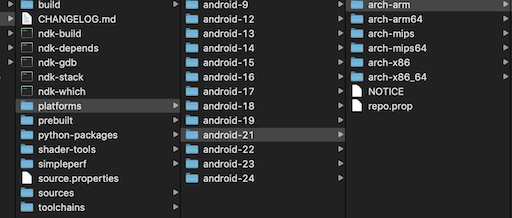
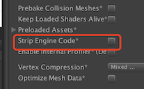
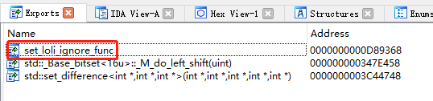

[TOC]

# Unreal Engine 4

## Frame Pointer Optimization

**This method requires newer versions of NDK, and only supports arm64-v8a architecture.**

**Use mobile phone with CPU like snapdragon 855 or newer to profile real heavy games.**

**Use test build and FMallocBinned mods to get the best performance.**

Test environment:

1. Unreal Engine 4.25 / 4.26，Android NDK r21c
2. Unreal Engine 4.24.3，Android NDK r14b

### Modify MallocBinned2

Unreal Engine 4.25 use FMallocBinned2 as the default memory allocator on Android platform.

Modifying this allocator instead of using FMallocAnis will increase the performance of your game.

```c++
--- a/Engine/Source/Runtime/Core/Public/HAL/MallocBinned2.h
+++ b/Engine/Source/Runtime/Core/Public/HAL/MallocBinned2.h
@@ -89,6 +89,21 @@ extern int32 RecursionCounter;
 #endif

+#ifdef USE_LOLI_PROFILER
+#ifdef __cplusplus
+extern "C" {
+#endif // __cplusplus
+
+	extern void (*loli_alloc_ptr)(void*, size_t);
+	extern void (*loli_free_ptr)(void*);
+
+#ifdef __cplusplus
+}
+#endif // __cplusplus
+#endif // USE_LOLI_PROFILER

@@ -444,6 +459,13 @@ public:
 		--RecursionCounter;
 		return Result;
 #else
+#ifdef USE_LOLI_PROFILER
+		void* Ptr = MallocInline(Size, Alignment);
+		loli_alloc_ptr(Ptr, Size);
+		return Ptr;
+#endif
 		return MallocInline(Size, Alignment);
 #endif
 	}
@@ -529,6 +551,14 @@ public:
 		--RecursionCounter;
 		return Result;
 #else
+#ifdef USE_LOLI_PROFILER
+		loli_free_ptr(Ptr);
+		void* NewPtr = ReallocInline(Ptr, NewSize, Alignment);
+		loli_alloc_ptr(NewPtr, NewSize);
+		return NewPtr;
+#endif
 		return ReallocInline(Ptr, NewSize, Alignment);
 #endif
 	}
@@ -613,6 +643,11 @@ public:
 		}
 		--RecursionCounter;
 #else
+#ifdef USE_LOLI_PROFILER
+		loli_free_ptr(Ptr);
+#endif
 		FreeInline(Ptr);
 #endif
 	}
```

```c++
--- a/Engine/Source/Runtime/Core/Private/HAL/MallocBinned2.cpp
+++ b/Engine/Source/Runtime/Core/Private/HAL/MallocBinned2.cpp
@@ -11,6 +11,34 @@
 #include "HAL/PlatformMisc.h"
 #include "Misc/App.h"

+#ifdef USE_LOLI_PROFILER
+#ifdef __cplusplus
+extern "C" {
+#endif // __cplusplus
+
+	__attribute__((noinline, optnone)) void loli_alloc(void* ptr, size_t size) {
+		(void)ptr;
+		(void)size;
+	}
+	__attribute__((noinline, optnone)) void loli_free(void* ptr) {
+		(void)ptr;
+	}
+
+	void (*loli_alloc_ptr)(void*, size_t) = &loli_alloc;
+	void (*loli_free_ptr)(void*) = &loli_free;
+
+	__attribute__((visibility("default"), noinline, optnone)) void loli_set_allocandfree(void (*alloc_ptr)(void*, size_t), void (*free_ptr)(void*)) {
+		loli_alloc_ptr = alloc_ptr;
+		loli_free_ptr = free_ptr;
+	}
+
+#ifdef __cplusplus
+}
+#endif // __cplusplus
+#endif // USE_LOLI_PROFILER
+
 PRAGMA_DISABLE_UNSAFE_TYPECAST_WARNINGS
```

### Modify MallocBinned

Unreal Engine 4.24 use FMallocBinned as the default memory allocator on Android platform.

```c++
#ifdef __cplusplus
extern "C" {
#endif // __cplusplus

__attribute__((noinline, optnone)) void loli_alloc(void* ptr, size_t size) {
	(void)ptr;
	(void)size;
}
__attribute__((noinline, optnone)) void loli_free(void* ptr) {
	(void)ptr;
}

void (*loli_alloc_ptr)(void*, size_t) = &loli_alloc;
void (*loli_free_ptr)(void*) = &loli_free;

__attribute__((visibility("default"), noinline, optnone)) void loli_set_allocandfree(void (*alloc_ptr)(void*, size_t), void (*free_ptr)(void*)) {
	loli_alloc_ptr = alloc_ptr;
	loli_free_ptr = free_ptr;
}

#ifdef __cplusplus
}
#endif // __cplusplus
```

**loli_alloc_ptr** is used when allocating memory, **loli_free_ptr** is used when freeing allocated memory.

If your application or custom game engine uses memory pool like Unreal Engine, you can add these wrapper function calls too.

```c++
void* FMallocBinned::Malloc(SIZE_T Size, uint32 Alignment) {
    // ....
#ifdef USE_LOLI_PROFILER
    loli_alloc_ptr(Free, Size); // <-- record allocation
#endif
    MEM_TIME(MemTime += FPlatformTime::Seconds());
    return Free;
}

void* FMallocBinned::Realloc(void* Ptr, SIZE_T NewSize, uint32 Alignment) {
    // ...
#ifdef USE_LOLI_PROFILER
    loli_free_ptr(Ptr); // <-- free old allocation
    loli_alloc_ptr(NewPtr, NewSize); // <-- record new allocation
#endif
    MEM_TIME(MemTime += FPlatformTime::Seconds());
    return NewPtr;
}

void FMallocBinned::Free(void* Ptr) {
#ifdef USE_LOLI_PROFILER
    loli_free_ptr(Ptr); // <-- record free allocation
#endif
    Private::PushFreeLockless(*this, Ptr);
}
```

### Modify FMallocAnsi

Unless you're using MallocAnsi by default, we don't recommend you to switch to FMallocAnsi allocator.

I uses system malloc() directly, which is way slower than Unreal Engine's memory pool.

```c++
--- a/Engine/Source/Runtime/Core/Private/Android/AndroidPlatformMemory.cpp
+++ b/Engine/Source/Runtime/Core/Private/Android/AndroidPlatformMemory.cpp
@@ -293,7 +293,11 @@ FMalloc* FAndroidPlatformMemory::BaseAllocator()
 	FLowLevelMemTracker::Get().SetProgramSize(Stats.UsedPhysical);
 #endif
 
-#if USE_MALLOC_BINNED3 && PLATFORM_ANDROID_ARM64
+#ifdef USE_LOLI_PROFILER
+	return new FMallocAnsi();
+#elif USE_MALLOC_BINNED3 && PLATFORM_ANDROID_ARM64
 	return new FMallocBinned3();
 #elif USE_MALLOC_BINNED2
 	return new FMallocBinned2();
```

### Add Compiler Options

We need to add [this](http://www.keil.com/support/man/docs/armclang_ref/armclang_ref_vvi1466179578564.htm) compiler option: **-fno-omit-frame-pointer**

This option will tell the application runtime to store stack function pointer to a register.

This is by far the fastest stack unwinding technique, use this if you can.

```c++
--- a/Engine/Source/Programs/UnrealBuildTool/Configuration/TargetRules.cs
+++ b/Engine/Source/Programs/UnrealBuildTool/Configuration/TargetRules.cs
@@ -1043,6 +1043,12 @@ namespace UnrealBuildTool
 		[XmlConfigFile(Category = "BuildConfiguration")]
 		public bool bUseMallocProfiler = false;
 
+		/// <summary>
+		/// If true, then enable loli memory profiling in the build (defines USE_LOLI_PROFILER=1).
+		/// </summary>
+		[XmlConfigFile(Category = "BuildConfiguration")]
+		public bool bUseLoliProfiler = false;

@@ -2373,6 +2379,11 @@ namespace UnrealBuildTool
 			get { return Inner.bUseMallocProfiler; }
 		}
 
+		public bool bUseLoliProfiler
+		{
+			get { return Inner.bUseLoliProfiler; }
+		}
+
 		public bool bUseSharedPCHs
 		{

+++ b/Engine/Source/Programs/UnrealBuildTool/System/RulesAssembly.cs
@@ -572,6 +572,13 @@ namespace UnrealBuildTool
 			UEBuildPlatform Platform = UEBuildPlatform.GetBuildPlatform(Rules.Platform);
 			Platform.ValidateTarget(Rules);
 
+			// Setup the loli profiler
+			if (Platform.Platform == UnrealTargetPlatform.Android && Rules.bUseLoliProfiler)
+			{
+				Rules.GlobalDefinitions.Add("USE_LOLI_PROFILER=1");
+				Rules.AdditionalCompilerArguments += " -fno-omit-frame-pointer";
+			}
```

After these mods, you can indicate your build system to build a Loli-Profiler exclusive apk.

Enable useLoliProfiler option in [BuildConfiguration.xml](https://docs.unrealengine.com/en-US/Programming/BuildTools/UnrealBuildTool/BuildConfiguration/index.html) file:

```xml
<?xml version="1.0" encoding="utf-8" ?>
<Configuration xmlns="https://www.unrealengine.com/BuildConfiguration">
    <BuildConfiguration>
        <bUseLoliProfiler>true</bUseLoliProfiler>
    </BuildConfiguration>
</Configuration>
```

This file exists in these folders:

```bash
# create if not exist
Engine/Saved/UnrealBuildTool/BuildConfiguration.xml
User Folder/AppData/Roaming/Unreal Engine/UnrealBuildTool/BuildConfiguration.xml
My Documents/Unreal Engine/UnrealBuildTool/BuildConfiguration.xml 
```

You can use readelf tool to check if your libUE4.so is packed correctly.

```bash
$ readelf -S file.so | grep "gnu_debugdata\|eh_frame\|debug_frame"
  [12] .eh_frame_hdr     PROGBITS         000000000000c2b0  0000c2b0
  [13] .eh_frame         PROGBITS         0000000000011000  00011000
  [24] .gnu_debugdata    PROGBITS         0000000000000000  000f7292
```

if the commands includes these sections, then you're good to go :D

```
.gnu_debugdata
.eh_frame (+ preferably .eh_frame_hdr)
.debug_frame.
```

## Instrument Functions Optimization

If you can't use frame pointer optimization, try this instead.

This option will imply the compiler to add a function call to every functions in libUE4.so, then we can implement our homemade stack unwinding function. It's very fast compared to libunwind.so.

First modify FMallocBinned like previous chapter.

### Add Compiler Options

Then we enable clang compiler option **-finstrument-functions-after-inlining**. This way the compiler will insert a function call to every functions(after in-line optimization).

```c++
--- a/Engine/Source/Programs/UnrealBuildTool/Configuration/TargetRules.cs
+++ b/Engine/Source/Programs/UnrealBuildTool/Configuration/TargetRules.cs
@@ -1043,6 +1043,12 @@ namespace UnrealBuildTool
 		[XmlConfigFile(Category = "BuildConfiguration")]
 		public bool bUseMallocProfiler = false;
 
+		/// <summary>
+		/// If true, then enable loli memory profiling in the build (defines USE_LOLI_PROFILER=1).
+		/// </summary>
+		[XmlConfigFile(Category = "BuildConfiguration")]
+		public bool bUseLoliProfiler = false;

@@ -2373,6 +2379,11 @@ namespace UnrealBuildTool
 			get { return Inner.bUseMallocProfiler; }
 		}
 
+		public bool bUseLoliProfiler
+		{
+			get { return Inner.bUseLoliProfiler; }
+		}
+
 		public bool bUseSharedPCHs
 		{

+++ b/Engine/Source/Programs/UnrealBuildTool/System/RulesAssembly.cs
@@ -572,6 +572,13 @@ namespace UnrealBuildTool
 			UEBuildPlatform Platform = UEBuildPlatform.GetBuildPlatform(Rules.Platform);
 			Platform.ValidateTarget(Rules);
 
+			// Setup the loli profiler
+			if (Platform.Platform == UnrealTargetPlatform.Android && Rules.bUseLoliProfiler)
+			{
+				Rules.GlobalDefinitions.Add("USE_LOLI_PROFILER=1");
+				Rules.AdditionalCompilerArguments += " -finstrument-functions-after-inlining";
+			}
```

If your clang is older than 7.0.0, or you're using gcc, try **-finstrument-functions** instead.

Then you need to implement a custom stack unwind function: 

Create  AndroidFunctionStub.cpp under Engine\Source\Runtime\Core\Private\Android

```c++
#include <pthread.h>
#include <android/log.h>

#ifdef __cplusplus
extern "C" {
#endif // __cplusplus

	#define MAX_TRACE_DEEP 128
	typedef struct {
		void* stack[MAX_TRACE_DEEP];
		int current = MAX_TRACE_DEEP - 1;
	} thread_stack_t;

	static pthread_once_t sBackTraceOnce = PTHREAD_ONCE_INIT;
	static pthread_key_t sBackTraceKey;

	void (*loli_ignore)(bool) = nullptr;

	void __attribute__((no_instrument_function)) destructor(void* ptr) {
		if (ptr) {
			free(ptr);
			ptr = nullptr;
		}
	}

	void __attribute__((no_instrument_function)) init_once(void) {
		pthread_key_create(&sBackTraceKey, destructor);
	}

	thread_stack_t* __attribute__((no_instrument_function)) get_backtrace_info() {
		thread_stack_t* ptr = (thread_stack_t*)pthread_getspecific(sBackTraceKey);
		if (ptr) {
			return ptr;
		}

		ptr = (thread_stack_t*)malloc(sizeof(thread_stack_t));
		ptr->current = MAX_TRACE_DEEP - 1;
		pthread_setspecific(sBackTraceKey, ptr);
		return ptr;
	}

	void __attribute__((no_instrument_function)) __cyg_profile_func_enter(void* this_func, void* call_site) {
		(void)call_site;
		if (loli_ignore)
			loli_ignore(true);
		pthread_once(&sBackTraceOnce, init_once);
		thread_stack_t* ptr = get_backtrace_info();
		if (ptr->current > 0) {
			ptr->stack[ptr->current--] = this_func;
		}
		if (loli_ignore)
			loli_ignore(false);

		//__android_log_print(ANDROID_LOG_INFO, "TEMP", "__cyg_profile_func_enter call");
	}

	void __attribute__((no_instrument_function)) __cyg_profile_func_exit(void* this_func, void* call_site) {
		(void)this_func;
		(void)call_site;
		if (loli_ignore)
			loli_ignore(true);
		pthread_once(&sBackTraceOnce, init_once);
		thread_stack_t* ptr = get_backtrace_info();
		if (++ptr->current >= MAX_TRACE_DEEP) {
			ptr->current = MAX_TRACE_DEEP - 1;
		}
		if (loli_ignore)
			loli_ignore(false);

		//__android_log_print(ANDROID_LOG_INFO, "TEMP", "__cyg_profile_func_exit call");
	}

	__attribute__((visibility("default"))) __attribute__((no_instrument_function)) int get_stack_backtrace(void** backtrace, int max)
	{
		if (loli_ignore)
			loli_ignore(true);
		pthread_once(&sBackTraceOnce, init_once);
		thread_stack_t* ptr = get_backtrace_info();

		int count = max;
		if (MAX_TRACE_DEEP - 1 - ptr->current < count)
		{
			count = MAX_TRACE_DEEP - 1 - ptr->current;
		}

		if (count > 0)
		{
			memcpy(backtrace, &ptr->stack[ptr->current + 1], sizeof(void*) * (count));
		}

		if (loli_ignore)
			loli_ignore(false);
		return count;
	}

	__attribute__((visibility("default"))) __attribute__((no_instrument_function)) void set_loli_ignore_func(void (*funcPtr)(bool)) {
		loli_ignore = funcPtr;
	}

#ifdef __cplusplus
}
#endif // __cplusplus
```

# Unity Engine

Tested version: Unity5.6.6f2、Unity2017.4.35f1、Unity2018.4.5f1

## Force unity to use system malloc

Add a launch parameter to UnityPlayerActivity.java:

```java
protected String updateUnityCommandLineArguments(String cmdLine) {
    return "-systemallocator";
}
```

## Unity 2018

This version of unity uses new Bee compiling system, if you're targeting arm64-v8a, you need to modify this file:

```c#
// Tools/Bee/Bee.Toolchain.Android/AndroidNdkCompiler.cs
// if (Optimization != OptimizationLevel.None)
// {
//     // important for performance. Frame pointer is only useful for profiling, but
//     // introduces additional instructions into the prologue and epilogue of each function
//     // and leaves one less usable register.
//     yield return "-fomit-frame-pointer";
// }
yield return "-fno-omit-frame-pointer"; // <- 打开Framepointer选项
```

For armeabi-v7a targets, you can only use **-finstrument-functions** mode.

## Unity 2017 & 5

You can use **-finstrument-functions** to speed up stack unwinding.

This is 10x faster in single thread than libunwind.

And 50x faster in multi thread test case.

The downside is that this option increases both APK size and compile time.

### Android_NDK.jam.cs

PlatformDependent/AndroidPlayer/Jam/Android_NDK.jam.cs

```c#
// 2017
            Vars.Android_CFLAGS_debug.Assign(
                "-O0",
                "-D_DEBUG",
                "-fno-omit-frame-pointer",
                "-finstrument-functions", // <-- add
                "-fno-strict-aliasing");
            Vars.Android_CFLAGS_release.Assign(
                "-Os",
                "-DNDEBUG",
                "-fomit-frame-pointer",
                "-finstrument-functions", // <-- add
                "-fstrict-aliasing");
// 5.6
// ########  Common flags for all toolchains ########
Android.CFLAGS.release = ... -finstrument-functions ;
Android.CFLAGS.debug = ... -finstrument-functions ;
```

Unity 2017 is using NDK r13b, which don't support **-finstrument-functions-after-inline**, you can swith to the after-inline version if your NDK is using clang 7.0.0 or newer.

### Define instrument function

We need to place the definition of instrument function so that every other file can include it automatically.

This is not a problem in Unreal Engine because it's Unity Build system. 

Select the correct architecture in this folder: 



Then add these codes to ndk's jni.h file, under arch folder's /usr/include folder: 

```c++
#ifndef JNI_H_
#define JNI_H_

#include <sys/cdefs.h>
#include <stdarg.h>

extern void __attribute__((no_instrument_function)) __cyg_profile_func_enter(void* this_func, void* call_site);
extern void __attribute__((no_instrument_function)) __cyg_profile_func_exit(void* this_func, void* call_site);
```

And now you can implement the defined functions:

```c++
#include <pthread.h>
#include <android/log.h>

#ifdef __cplusplus
extern "C" {
#endif // __cplusplus

    #define MAX_TRACE_DEEP 128
    typedef struct {
        void* stack[MAX_TRACE_DEEP];
        int current = MAX_TRACE_DEEP - 1;
    } thread_stack_t;

    static pthread_once_t sBackTraceOnce = PTHREAD_ONCE_INIT;
    static pthread_key_t sBackTraceKey;

    void (*loli_ignore)(bool) = nullptr;

    void __attribute__((no_instrument_function)) destructor(void* ptr) {
        if (ptr) {
            free(ptr);
            ptr = nullptr;
        }
    }

    void __attribute__((no_instrument_function)) init_once(void) {
        pthread_key_create(&sBackTraceKey, destructor);
    }

    thread_stack_t* __attribute__((no_instrument_function)) get_backtrace_info() {
        thread_stack_t* ptr = (thread_stack_t*)pthread_getspecific(sBackTraceKey);
        if (ptr) {
            return ptr;
        }

        ptr = (thread_stack_t*)malloc(sizeof(thread_stack_t));
        ptr->current = MAX_TRACE_DEEP - 1;
        pthread_setspecific(sBackTraceKey, ptr);
        return ptr;
    }

    void __attribute__((no_instrument_function)) __cyg_profile_func_enter(void* this_func, void* call_site) {
        (void)call_site;
        if (loli_ignore)
            loli_ignore(true);
        pthread_once(&sBackTraceOnce, init_once);
        thread_stack_t* ptr = get_backtrace_info();
        if (ptr->current > 0) {
            ptr->stack[ptr->current--] = this_func;
        }
        if (loli_ignore)
            loli_ignore(false);

        //__android_log_print(ANDROID_LOG_INFO, "TEMP", "__cyg_profile_func_enter call");
    }

    void __attribute__((no_instrument_function)) __cyg_profile_func_exit(void* this_func, void* call_site) {
        (void)this_func;
        (void)call_site;
        if (loli_ignore)
            loli_ignore(true);
        pthread_once(&sBackTraceOnce, init_once);
        thread_stack_t* ptr = get_backtrace_info();
        if (++ptr->current >= MAX_TRACE_DEEP) {
            ptr->current = MAX_TRACE_DEEP - 1;
        }
        if (loli_ignore)
            loli_ignore(false);

        //__android_log_print(ANDROID_LOG_INFO, "TEMP", "__cyg_profile_func_exit call");
    }

    __attribute__((visibility("default"))) __attribute__((no_instrument_function)) int get_stack_backtrace(void** backtrace, int max)
    {
        if (loli_ignore)
            loli_ignore(true);
        pthread_once(&sBackTraceOnce, init_once);
        thread_stack_t* ptr = get_backtrace_info();

        int count = max;
        if (MAX_TRACE_DEEP - 1 - ptr->current < count)
        {
            count = MAX_TRACE_DEEP - 1 - ptr->current;
        }

        if (count > 0)
        {
            memcpy(backtrace, &ptr->stack[ptr->current + 1], sizeof(void*) * (count));
        }

        if (loli_ignore)
            loli_ignore(false);
        return count;
    }

    __attribute__((visibility("default"))) __attribute__((no_instrument_function)) void set_loli_ignore_func(void (*funcPtr)(bool)) {
        loli_ignore = funcPtr;
    }

#ifdef __cplusplus
}
#endif // __cplusplus
```

Rename this file to AndroidLoli.cpp and put it to these folders:

```bash
PlatformDependent/AndroidPlayer/Source/main/AndroidLoli.cpp
PlatformDependent/AndroidPlayer/Source/AndroidLoli.cpp
```

And now you've implemented custom unwinding function in both libunity&libmain file. 

### Packaging

Use perl build.pl to build the correct libunity.so.

Make sure to disable Engine code stripping: 



Use ida or ndk tools to check if our function is exported correctly.



Use **adb logcat -s Loli** to check runtime logs to see if it's working:

```
set_loli_ignore_func found at 0xc4c8a368
get_stack_backtrace found at 0xc4c8a238
```