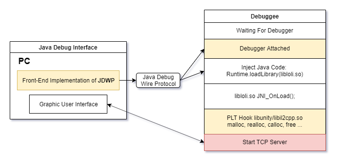
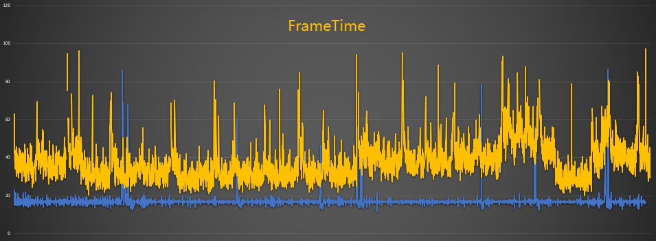
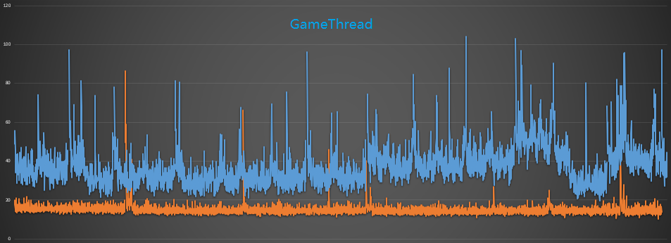
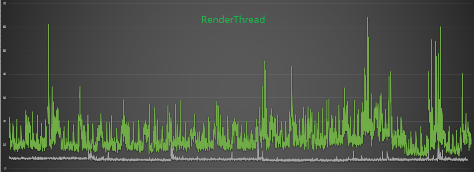
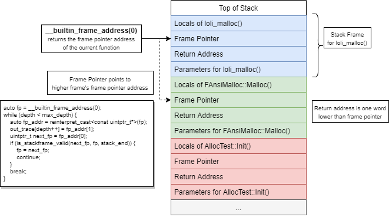
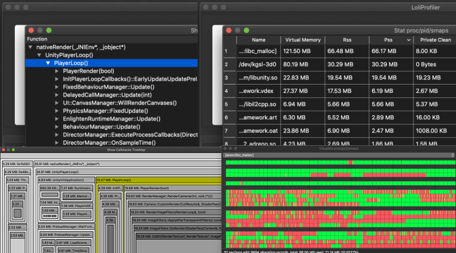

[TOC]

# 高效安卓非托管内存分析解决方案

## 摘要

​	安卓平台一直缺乏简单易用的非托管内存数据采集与分析的工具或流程，本项目意在通过整合安卓平台相关技术，提供一种易用且高效（数据采集）的非托管内存分析解决方案。

## 原理

### 数据采集

​	通过JDWP（Java Debug Wire  Protocol）协议，可以非侵入式的方式对目标程序进行Java代码注入，利用此方法，可在Java层注入加载动态链接库的代码，达成外部代码注入的目标。后结合ELF格式动态链接库的特性，对想要检测的目标进行PLT Hook，替换其所使用的底层内存分配、释放函数，即可完成数据采集的过程。结合Adb（Android Debug  Bridge）可将数据通过Socket传输到PC进行离线分析。

### 性能优化

​	经性能测试发现性能瓶颈在堆栈回溯这一步。遂对几种常见的堆栈回溯技术进行了研究：

| 堆栈回溯技术          | 优点     | 缺点               |
| --------------------- | -------- | ------------------ |
| libunwind.so          | 即插即用 | 速度慢             |
| instrument-functions  | 速度快   | 重新编译、包体增大 |
| no-omit-frame-pointer | 速度最快 | 重新编译           |

​	 第一种回溯技术主要的优点是即插即用，绝大多数APK中的动态链接库均可使用此方法在运行时进行堆栈回溯。对于内存分配不是很频繁的小型项目，其性能也是足够支撑的。我们也通过另一个角度（减少需要采集的数据总量）尝试进行了优化，此优化参考了GooglePerfetto的设计，通过统计学原理在有一定准确性的基础上降低了需要采集的数据总量。

​	第二种回溯技术源自[高德地图](https://developer.aliyun.com/article/708672)的技术文章，通过编译器选项对所有函数进行插桩，在桩函数中通过无锁结构进行堆栈回溯，多线程性能达到默认回溯技术的10倍。其主要缺点为桩函数会大大增加包体大小，对于大型项目影响较大。

​	第三种回溯技术源自GoogleAsan项目，是一种基于寄存器的堆栈回溯方案，其性能优于编译器插桩方案，且不会对包体大小造成影响，是目前在编译器支持的情况下最优的方案。

|                         | Time     | APK    | libUE4.so |
| ----------------------- | -------- | ------ | --------- |
| 基准                    | 00:14.34 | 217MiB | 1.68G     |
| framepointer            | 00:14.34 | 217MiB | 1.68G     |
| instruemnt after-inline | 00:18.38 | 226MiB | 1.72G     |
| instruemnt              | 00:49.88 | 330MiB | 2.45G     |
| basic method            | 08:05.41 | 217MiB | 1.68G     |

*UE4第三人称Demo使用不同方案的性能测试数据*

*对比了从打开APK开始到进入游戏场景所花费的时间*

### 真机性能表现

使用骁龙865CPU的手机对一款在研大型UE4 FPS项目进行测试。

打的是Test包，采集了122秒的数据，平均FPS从57下降到26，仍可较流畅体验游戏。

游戏线程平均增加1.65倍负载，渲染线程平均增加2.2倍负载。

**建议使用骁龙855，麒麟990或更强的CPU进行大型项目的数据采集**

通过选项-fno-omit-frame-pointer，将FramePointer存储到一个通用寄存器中，结合__builtin_frame_address(0)得到此FramePointer寄存器地址，即可获取调用堆栈中的函数地址数据，原理如上图。

### 存储优化

​	大型（游戏）项目内存分配非常频繁，某项目在480秒内采集到了1000万条数据，平均每秒2万5千条数据。如此体量的数据简单存储在内存，很快就会对内存造成巨大的压力，因此我们尝试对数据的存储做了优化。

​	 首先对内存做了一系列常规的优化，例如使用UINT64存储函数地址，通过动态库名称的Hash标记记录的归属等。其次我们实现了数据的Streaming方案，在数据采集的过程中，按数据量的大小，将数据定量（512MiB为单位）写入硬盘，有效降低了内存占用。采集结束后，通过收集到的内存释放信息表，逐个将缓存文件载入内存，且只将未释放（泄漏可疑）的内存分配记录存储到内存中。通过这些方法，最终将采集过程、数据分析过程的内存占用降到了最低的水平。结合高效的堆栈回溯技术，可有效支持大型（游戏）项目的数据采集与分析。

