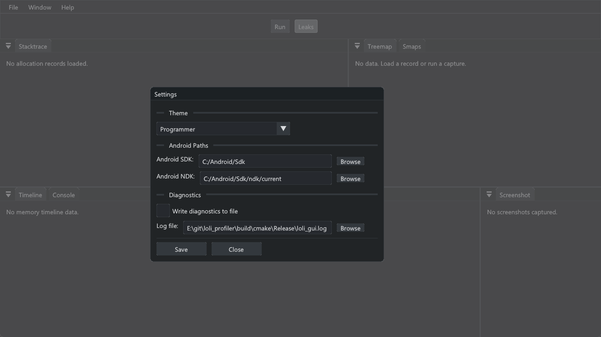
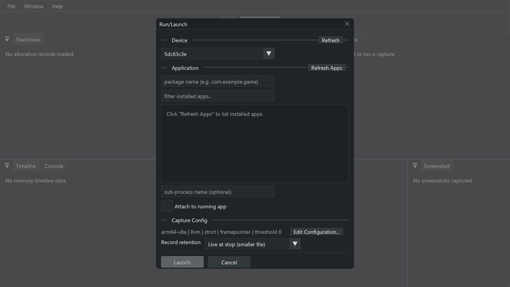
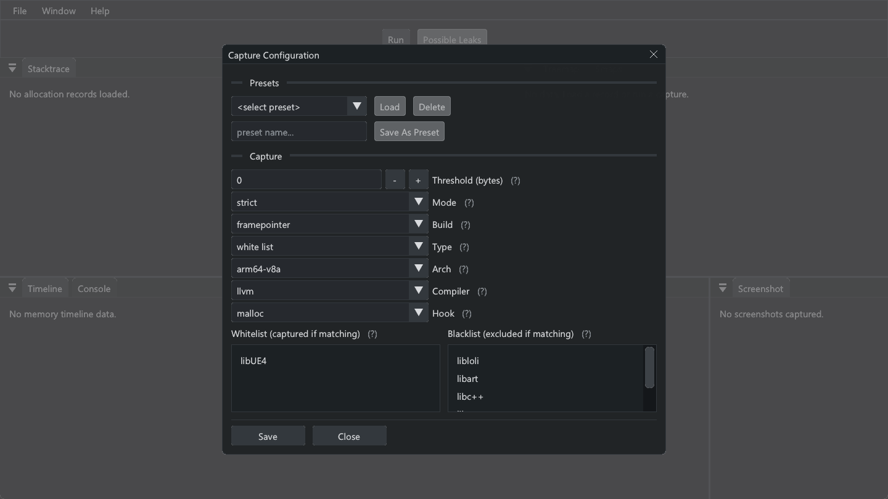
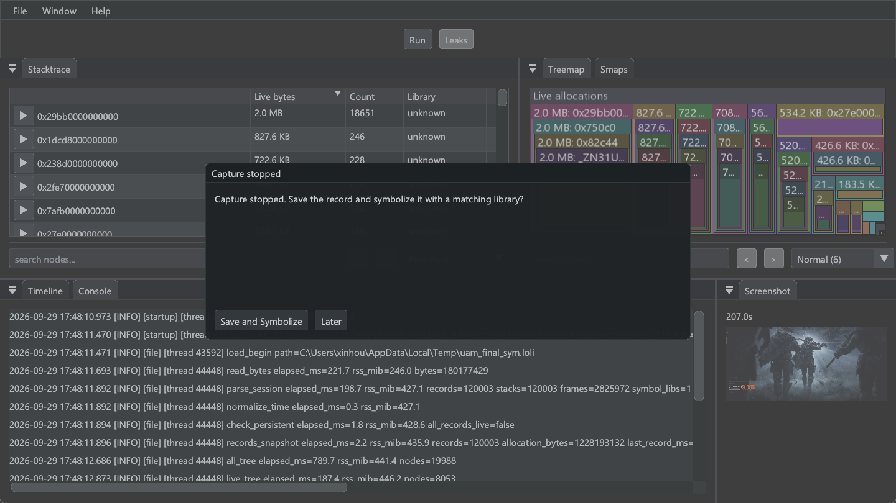
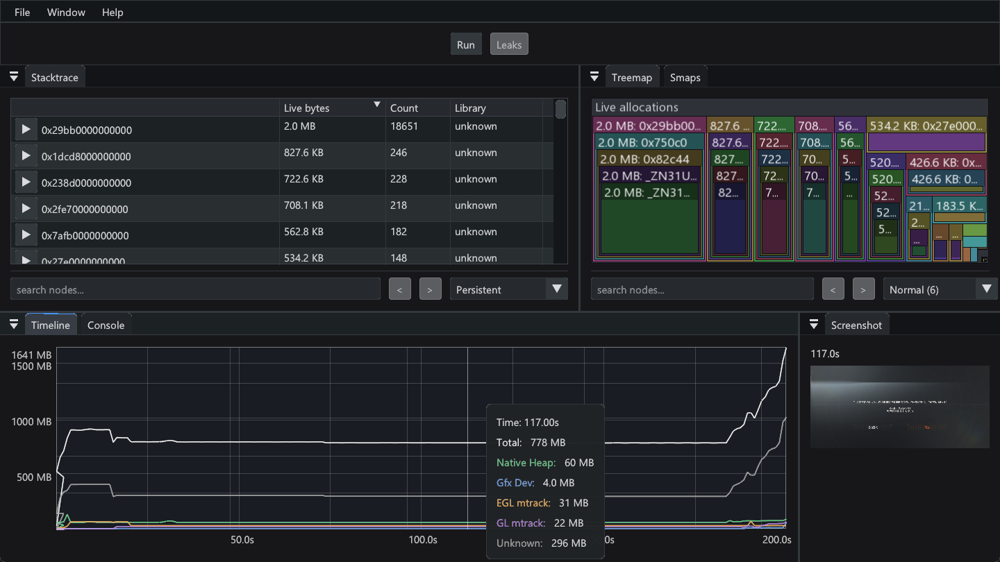

# Quick start

LoliProfiler captures native memory allocation call stacks from Android applications. The desktop app is `LoliProfilerImGui`; `LoliProfilerCLI` provides headless capture and file conversion.

## 1. Set Android paths

Open **File > Settings**. Choose the Android SDK used by your other development tools; its `platform-tools/adb` is the client LoliProfiler runs. Set an Android NDK path for symbol translation. The app remembers both paths.



Connect and authorize the device, then check that it appears in **Run/Launch**. ADB clients normally share one server; using the same SDK Platform-Tools copy as Android Studio or Unreal avoids competing server versions. Do not issue `adb kill-server` during a capture.

## 2. Choose a capture

Click **Run** in the toolbar or File menu (Ctrl+R on Windows/Linux, Cmd+R on macOS) to open **Run/Launch**. Select the device and enter the Android package name, or choose it from **Refresh Apps**. Select **Attach to running app** if the process is already running. The injector waits for an activity resume; background and foreground the app if attach waits there.



Choose the launch-time **Record retention** policy:

- **Live at stop (smaller file)** retains allocations still live at capture stop; this is the default.
- **All allocations (full history)** retains cumulative allocation traffic.

Click **Edit Configuration** to set the ABI, compiler hook library, capture mode, stack unwinder, `malloc`/`mmap` hook, threshold, and library lists. Hover `(?)` for concise option details. Right-click a white/black list to add or remove an entry; double-click a row to edit it.



For UE games, start with the ABI matching the process, `llvm`, `strict`, `framepointer` if the game was built with frame pointers, and a whitelist entry such as `libUE4`. A matching `remote/<compiler>/<arch>/libloli.so` must be in the release package.

## 3. Capture and save

Click **Launch** or **Attach**, then use the app normally. While recording, the toolbar's **Run** button becomes **Stop Capture**, and a dark overlay blocks the data panels. Press **Stop Capture** when the desired period is covered. The overlay also clears if the connection is lost.

The **Capture stopped** dialog offers **Save and Symbolize** or **Later**. Choose **Save and Symbolize**, select a symbol library from the same app build, then choose a `.loli` destination. Wait for the save and symbolization progress dialog to close. The GUI writes a separate `.symbolized.loli` file and opens it when symbolization succeeds. **Later** leaves the capture available in the GUI; use **File > Save Record As** (Ctrl+S / Cmd+S) and **File > Symbolize Record** when ready. The original `.loli` file is kept.



The timeline, stacktrace tree, treemap, smaps, and screenshot panels show the captured data. Screenshots taken during a capture are saved in the `.loli` file and remain in its symbolized copy; symbolization does not generate screenshots missing from an older file. In Stacktrace, the dropdown after the search arrows selects **All Allocations** or **Persistent** for both Stacktrace and Treemap. It changes only the saved-file view, not what was retained during launch. Type a function name in Stacktrace or Treemap and press Enter to select the next match; `<` and `>` navigate matches.

The **Console** tab shows launch steps, file operations, errors, and timing measurements. Reopen it with **Window > Console**; right-click the log text for **Copy all** or **Clear view**. It scrolls with new messages only while already at the bottom. To save diagnostics, enable **Write diagnostics to file** and set a path in **File > Settings > Diagnostics**, or start the GUI with `LoliProfilerImGui --log-file profiler.log`. `--log-file` without a path writes `loli_gui.log` beside the executable. File logging is off by default. Use `--log-level debug` for source-tagged debug records; GUI and CLI use the same logger.

Drag across the timeline to select a time interval. Stacktrace and Treemap then show allocations recorded within that interval; clear the selection to see the complete capture. With an interval selected, click **Leaks** in the toolbar and choose **Tree View** or **Treemap**. The result compares cumulative allocations at the two interval marks and shows callstacks that grew by at least 1 KiB. The **Persistent** view also excludes allocations freed by the end of the capture from this comparison.



## 4. Resolve symbols and analyze files

Function names require a symbol library from the **same build** as the APK. The GUI uses the bundled CLI for symbolization. To run it directly without touching the device:

```text
LoliProfilerCLI --symbolize capture.loli --symbol libUE4.so --out capture-symbolized.loli
```

For an indexed SQLite snapshot usable by the Python `agentcli` package:

```text
LoliProfilerCLI --dump capture-symbolized.loli --out capture.db
python -m agentcli.cli summary capture.db
```

The installed `loli` command is an alias for `agentcli`. See the [CLI guide](CLI_MODE.md) for timed capture, comparison, and dump options, and [troubleshooting](TROUBLE_SHOOTING.md) for device or symbol problems.
