[TOC]

# 如何使用

首先请关闭如 Android Studio / Unreal Engine 编辑器 等可能使用 adb 端口的软件。

在MacOS BigSur等权限管理严格的系统上，也需要执行此命令 **sudo spctl --master-disable**。

## 配置


当你下载到最新版的 LoliProfiler后，首先需要设置 Android SDK / Android NDK 的路径：

*小提示: 使用 Command+Shift+G 可以 Goto 到访达中的任意位置。*

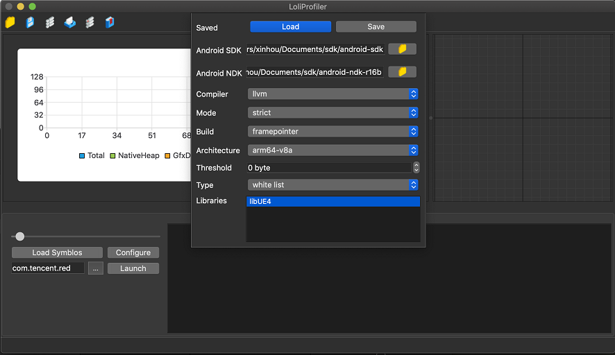

*小提示: 使用 ESC来退出设置界面。*

### 设置参数

接下来我们需要为你的安卓程序设置正确的调试参数：

#### 编译器 Compiler

首先我们需要选择正确的编译器。对于老程序请选择 gcc 编译器 （即代码工程使用 NDK r16b 或更早的版本）。对于更新的程序，比如 UE4.25/4.26，请选择 llvm。

*如果你混合使用了 gcc 和 clang 的动态库，那你就必须做出选择了，我们因为技术限制不支持同时调试 gcc 与 clang 的动态库。*

你可以尝试使用此命令查看你的so库是用什么编译器构建的，但一般情况下这个都不太靠谱 ::smile::

```bash
# android-ndk-r16b\toolchains\arm-linux-androideabi-4.9\prebuilt\windows-x86_64\bin\arm-linux-androideabi-readelf.exe
readelf -p .comment path/to/your/library
# some library write compiler related info in comment section, but this may not be accurate. 
# String dump of section '.comment':
# [     1]  GCC: (GNU) 4.9.x 20150123 (prerelease)
```

#### 模式 Mode

选择内存分配记录采集模式

##### 严格模式 Strict Mode

当你初次使用时，请选择此模式，此模式可用于小的测试工程。

此模式会记录所有内存申请值大于 **Threshold**（阈值，单位Byte）的分配记录。

##### 统计学模式 Loose Mode

此模式使用 perfetto 的 [heapprofd](https://perfetto.dev/docs/data-sources/native-heap-profiler) 中相同的原理。

利用统计学原理，此模式会降低内存申请记录的采集频率，从而达到比严格模式更优的性能。

当严格模式太卡，可尝试使用此模式。 

采集频率使用 **Threshold**（阈值，单位Byte）控制，建议的采集频率范围是 1024(1KiB) 到1048576(1MiB)之间。

##### 无堆栈模式 No Stack Mode

顾名思义，此模式不记录调用堆栈，只记录内存申请大小。此模式常用于统计动态库的总体内存分配情况。

因为它不采集调用堆栈，因此不会对真机性能造成太大的影响。

 #### 打包 Build

当你自己使用我们提供的方法修改&重新打包了你的APK。

就可以在此选择你所使用的 堆栈回溯 优化技术。

##### 默认回溯方案 Default

当你直接使用未修改的APK时，请使用此模式。

此模式使用安卓系统自带的 libunwind.so 进行堆栈回溯，此回溯方案性能不佳，但其可直接使用。

##### 插桩回溯方案 Instrumented

此模式需要你重新编译APK，当你根据[教程](GAME_ENGINE_CN.md)重新打包后，可使用此模式。

此模式比 libunwind.so 要快的多，单线程10倍，多线程50倍，其缺点是会增大APK包体。

##### 寄存器回溯方案 Frame pointer

此方案是最快的堆栈回溯方案。当你使用比较新的 NDK （比如r20）并且使用 arm64-v8a 架构，建议根据[教程](GAME_ENGINE_CN.md)重新打包你的APK。

此方案比插桩方案更快，因为它将函数地址保存在了寄存器中，从而大大降低了堆栈回溯的额外负载。

当你使用 UE4.25/4.26 或者比较新的 Unity引擎时，一定要试试这种模式。并且此模式是对重型游戏的唯一推荐模式。

#### 架构 Architecture

选择正确的 APP 架构，armeabi-v7a 或 arm64-v8a，我们也支持上古架构 armeabi （当你选择gcc编译器时）。

#### 阈值 Threshold

阈值 与 模式 **Mode**需要一同配置，不同模式下其有不同的含义。

#### 动态库列表 Type & Libraries

在此设置你需要采集数据的动态库的列表，此列表可选择是黑名单或白名单。

第一次使用的话，建议先用白名单。

比如如果你是 Unity 游戏，把 libunity 填到表格中即可，虚幻引擎就填 libUE4。

**注意: 大型游戏建议重新打包，以获得最佳体验。详见 [Game Engine](GAME_ENGINE_CN.md).**

##### 白名单 White List

表示列表中配置的动态库就是我们需要Hook的目标。

##### 黑名单 Black List

表示除了配置的库，其他加载进APP的动态库都自动尝试 Hook。

当你使用gcc编译器时，我建议把这些动态库加入到黑名单中，因为他们是用 clang 编译的：

```bash
libloli,libart,libc++,libc,libcutils,libart_base,libart_compiler
```

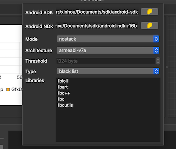

如果你同时 Hook 了 clang和gcc的动态库，你的程序会崩溃的，因为 [ABI](https://en.wikipedia.org/wiki/Application_binary_interface) 不兼容的原因。

**如果采集数据的过程导致你的APP非常卡，以至于无法正常使用。我们建议你使用[文档](GAME_ENGINE_CN.md)中描述的方案选择合适的技术来重新打包你的APK。**

## 选择目标APP

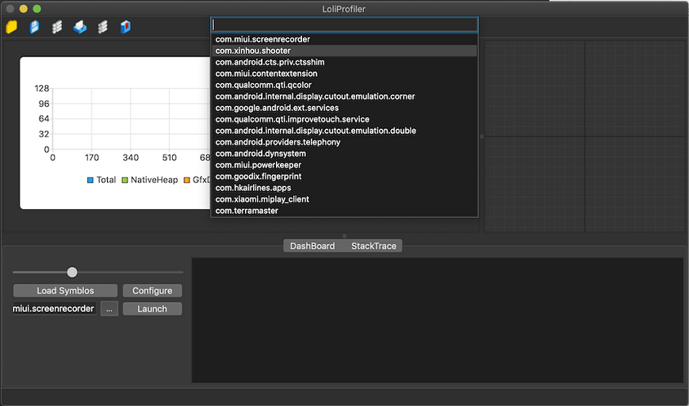

点击 Launch 旁边的 ... 按钮来选择你想要调试的程序。

## 拉起目标程序

点击 Launch 按钮拉起你的程序，然后选择使用 拉起 还是 挂载 的模式：

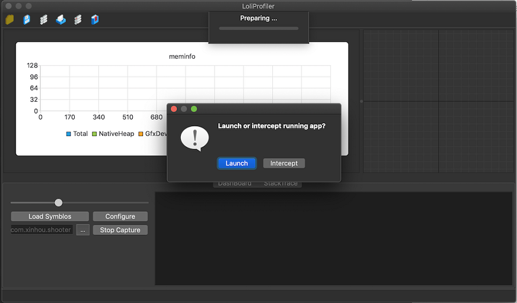

如果你需要使用挂载模式，选择后界面会停止在 “Injecting libloli.so xxx” 中。此时将你的APP缩小到后台，然后再切换回前台，就可以成功挂载上我们的 Debugger。这是因为我们 Debugger 的断点打在 Activity 的 onResume 函数中，因此需要这样操作。::smile::

如果你采集的是大型项目，需要打开 Enable memory optimization 开关来降低内存占用，此模式只保存没有被释放的内存分配记录。

关闭此优化则会保存所有内存分配记录，适用于Demo或小型项目。

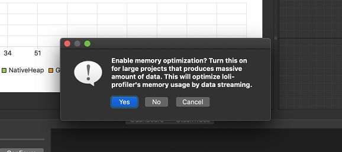

当你点击拉起按钮后，Profiler内部做了下面的工作：

```bash
# 把 libloli push 到手机上
adb push remote/libloli.so  /data/local/tmp
# 标记 app 下次启动等待 debugger，并拉起进程
adb shell am set-debug-app -w com.company.app
adb shell monkey -p com.company.app -c android.intent.category.LAUNCHER 1
# 拿到 jdwp id，并做端口转发，用于传输数据
adb jdwp
adb forward tcp:8700 jdwp:xxxx
# 最后 使用 jdwp 协议来注入代码，以执行 libloli.so 中的代码逻辑
python jdwp-shellifier.py --target 127.0.0.1 --port 8700 --break-on android.app.Activity.onResume --loadlib libloli.so
```

## 采集数据

当你采集到足够的数据后，可点击 **Stop Capture** 来停止数据采集。

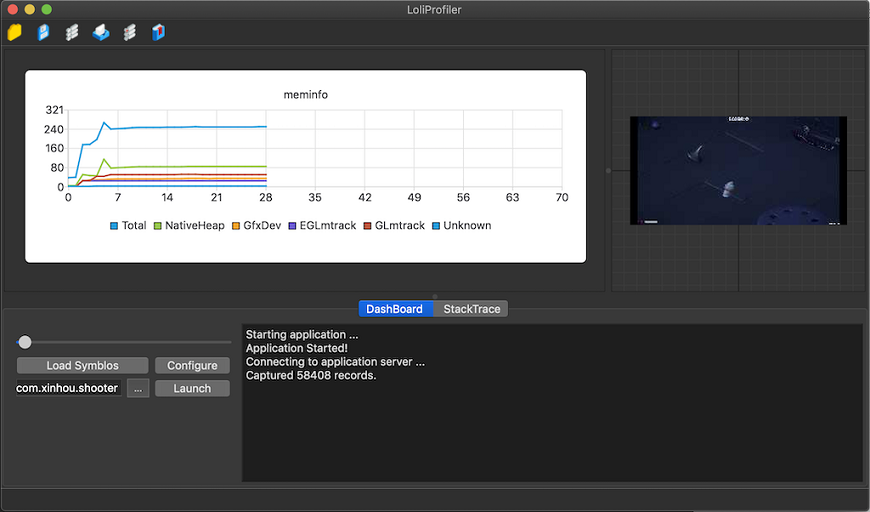

停止采集后，Log中会显示你所采集的数据总量：

```bash
# 意思是你采集了 189381 条内存申请、释放的记录
Captured 189381 records.
```

## 翻译数据

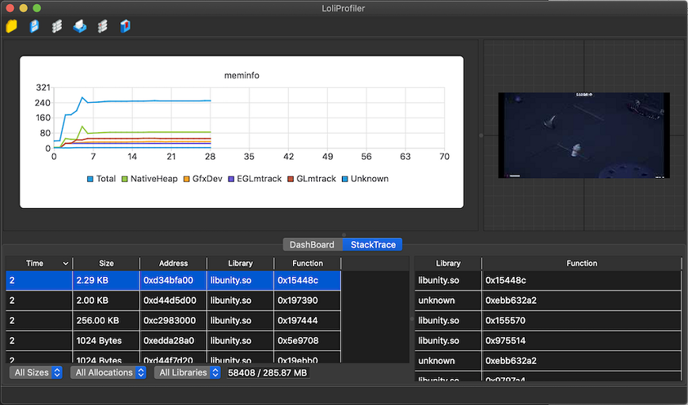

现在你可以切换到 **StackTrace** 页签，选择左侧任意一条记录，其调用堆栈会展示在右侧界面中。

可以看到调用堆栈是函数地址，这是因为函数地址翻译函数名称的过程是非常耗费CPU的，因此我们将此步骤做到PC上离线去处理，以提高调试过程中的性能。

切换至 **Dashboard** 页签，点击 **Load Symbols** 按钮，在这里选择正确的符号表文件（如果堆栈中有多个动态库，可依次将其符号加载进来）：

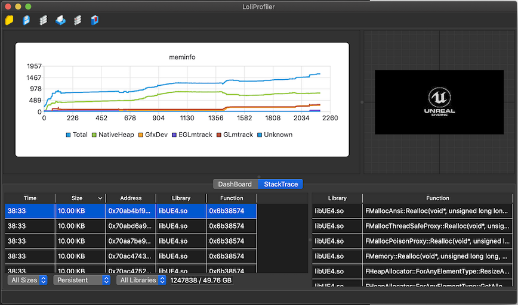

Unity引擎的 libil2cpp.so/libunity.so 符号表在如下目录：

```bash
Temp\StagingArea\libs\armeabi-v7a\
Editor\Data\PlaybackEngines\AndroidPlayer\Variations\il2cpp\Development\Symbols\armeabi-v7a\
```

可拷贝出单条记录的详细信息：

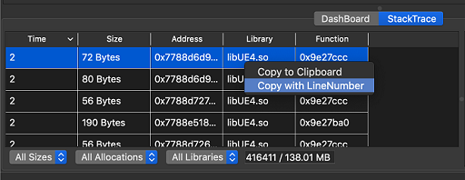

## 查看数据

Profiler支持多种数据查看过滤器，可以通过申请记录大小、是否常驻、所属动态库进行数据过滤。

**Persistent** 选项会筛选出常驻内存，即未被释放的内存申请记录。

也可以通过时间轴对数据进行时间上的过滤：

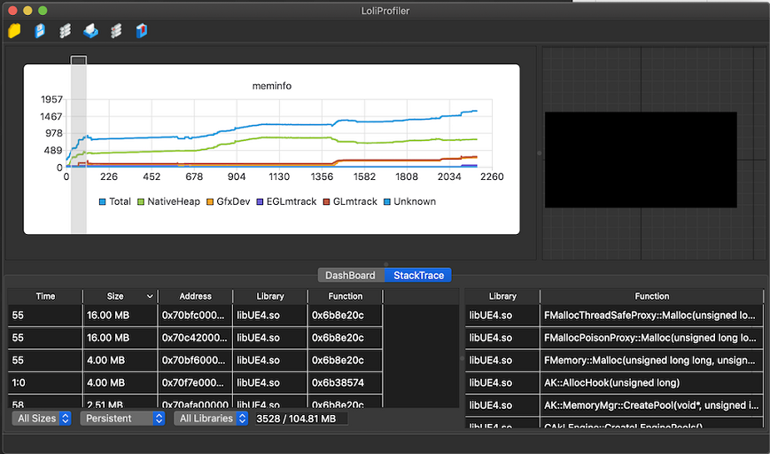

在 Mac OS 的触摸板上，用一个手指点击，另一个手指拖拽，即可选择时间区间。

Windows 上使用鼠标同时按住 Shift 按键，可选择时间区间。

点击 **Tools->Show Merged Callstacks** 则会展示出聚合后的堆栈：

我们提供两种数据展示模式：

TreeView模式：与Mac OS Instrument 工具包中的 Allocation 工具相同

同时支持模糊搜索，可根据函数名称进行搜索

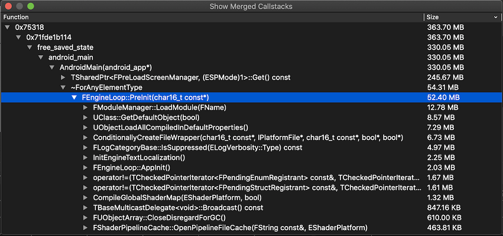

TreeMap模式：此模式比TreeView模式更直观，适合检查筛选问题最大的地方

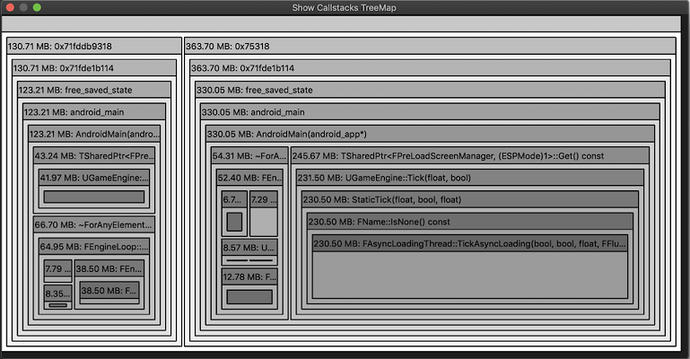

我们也支持内存泄漏检测模式：

通过 **Tools->Show Leaks** 菜单进入

同样可通过Tree View或者Tree Map模式查看可能存在内存泄漏的调用堆栈。

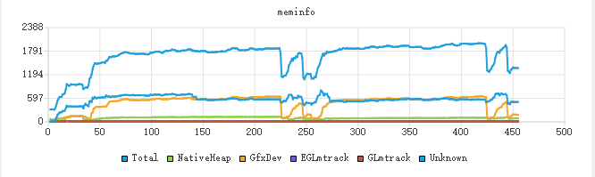

首先跑几次游戏单局，如图中跑了两次单局，波谷处为游戏大厅

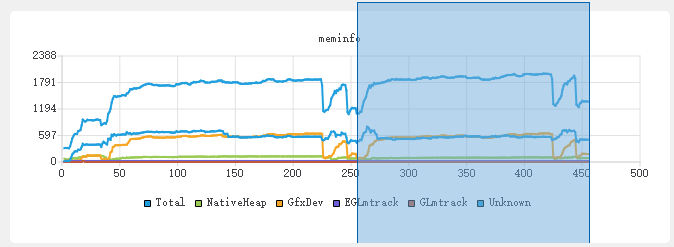

然后选择一段时间范围，从第二个单局的起始位置到结束位置

Profiler就会去Diff 时间范围在[0s-250s]与[0s-450s]的常驻内存数据

最终将有增长的堆栈输出出来：

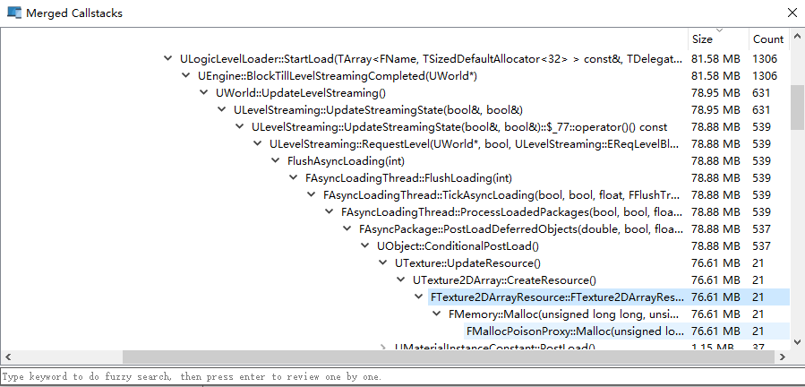

也可查看进程的 proc/pid/smaps 数据：

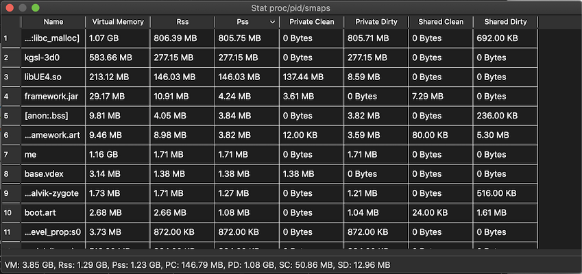

并且可以查看内存碎片的情况：

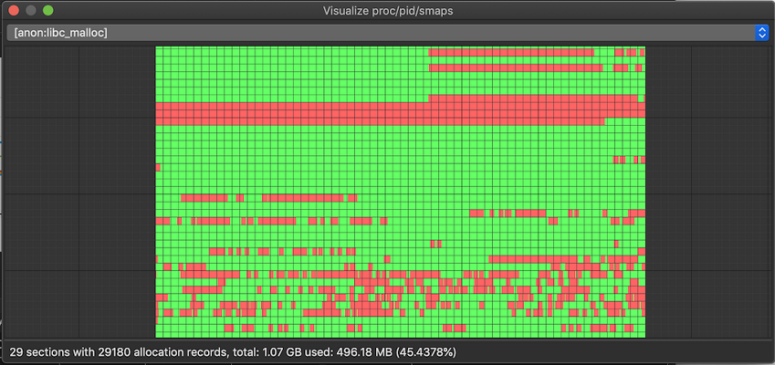

## 保存数据

退出Profiler之前别忘了保存你的数据 ::smile::