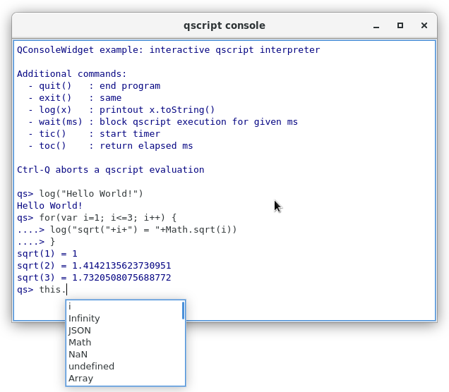

# QConsoleWidget

> part of **QDaq** (https://gitlab.com/qdaq/qdaq) - Qt-based Data Acquisition

A lightweight Qt5 console widget based on QPlainTextEdit providing 
also a QIODevice interface.

It can be used as an interactive scripting terminal or a log window.
Features include standard console-like editing, command history, 
formatted input, output & error streams.

TODO: syntax highlighting

## Usage

Instantiate the widget and set it to input mode. Connect a QObject slot
to the consoleCommand signal to receive the user input.

```c++
QConsoleWidget w;
w.writeStdOut("enter command> ");
w.setMode(QConsoleWidget::Input);
QObject::connect(&w,SIGNAL(consoleCommand(QString)),MyQObject,SLOT(evalCommand(QString)))
...
MyQObjet::evalCommand(const QString& code)
{
    ...
}
```

Alternatively you can use a QTextStream to interact with QConsoleWidget:

```c++
QConsoleWidget w;
w.device()->open(QIODevice::ReadWrite); // open the console's QIODevice
QTextStream stream(w.device());
stream << "Hello World!" << endl; // output goes to the widget
```

The stream can also be used for input

```c++
stream << "Enter an integer n = " << flush;
int n;
stream.device()->waitForReadyRead();
stream >> n;
```
The call to ```waitForReadyRead()``` enters a local loop waiting for
the user to enter a command and hit return. 

## Example

The included example implements a graphical scripting console for QtScript.



